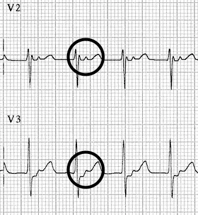

# AVNRT
- The most common supraventricular arrhythmia in humans. AVNRT is typically paroxysmal and may occur spontaneously or upon provocation with exertion, caffeine, alcohol, beta-agonists (salbutamol) or sympathomimetics (amphetamines). It is more common in women than men (~75% of cases occurring in women) and may occur in young and healthy patients as well as those suffering chronic heart disease
- The tachycardia typically ranges between 140-280 bpm and is regular in nature. It may self-resolve or continue indefinitely until medical treatment is sought
- In comparison to AVRT, which involves an _anatomical_ re-entry circuit (Bundle of Kent), in AVNRT there is a _functional_ re-entry circuit within the AV node

## AVRNT Subtypes
Different subtypes vary in terms of the dominant pathway, and the **R-P interval,** which is the time between anterograde ventricular activation (R wave) and retrograde atrial activation (P wave):
1.  **Slow-Fast AVNRT (80-90%).** Associated with slow AV nodal pathway for anterograde conduction and fast AV nodal pathway for retrograde conduction. The retrograde P wave is obscured in the corresponding QRS or occurs at the end of the QRS complex as pseudo R’ or S waves
	1. 
2. **Fast-Slow AVNRT (10%).** Associated with Fast AV nodal pathway for anterograde conduction and Slow AV nodal pathway for retrograde conduction. Due to the relatively long ventriculo-atrial interval, the retrograde P wave is more likely to be visible after the corresponding QRS and before the corresponding T wave.
	1. 
3.  **Slow-Slow AVNRT (1-5%).** Associated with Slow AV nodal pathway for anterograde conduction and Slow left atrial fibres as the pathway for retrograde conduction. Tachycardia with a P-wave seen in mid-diastole, effectively appearing “before” the QRS complex. May be misinterpreted as sinus tachycardia.

> [!NOTE] AVNRT Subtypes
> -   No visible P waves? –> Slow-Fast
> - P waves visible _after_ the QRS complexes? –> Fast-Slow
> - P waves visible _before_ the QRS complexes? –> Slow-Slow

# AVRT
- "Atrioventricular Re-entrant Tachycardia"
- Arises due to an accessory pathway: a strand of myocardium connects the atria and ventricles, bypassing the AV node
- Two types based on the direction of conduction:
	1) Orthodromic- antegrade conduction via the AV node (Left)
	2) Antidromic- antegrade conduction via the accessory pathway (Right)

### Orthodromic AVRT
Conduction is via AVN, leading to a *narrow complex rhythm* (in the absence of a BBB). Rate typically 200-300 bpm, retrograde P waves are visible with a long RP interval (>70 ms) which differentiates it from typical AVNRT (retrograde P waves are early or buried in the terminal QRS).

### Antidromic AVRT
Conduction is via an accessory pathway, leading to a regular *wide complex rhythm* which can be difficult to distinguish from VT. This rhythm can be difficult to distinguish from VT, and if there is any doubt, we should presume a diagnosis of VT and treat accordingly. Procainamide (class I) would be our first line antiarrhythmic. Ibutilide (class III) and amiodarone are second-line options, but their effectiveness is less established.

# References
1. LITFL