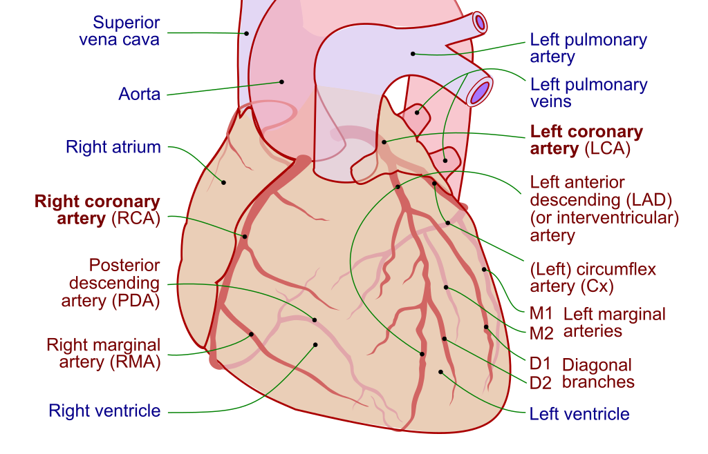
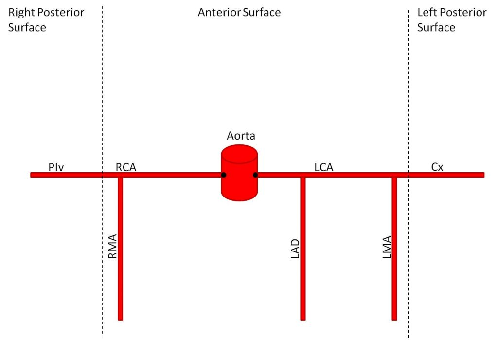

# Coronary Artery Anatomy

# Aortic Sinuses
These are small openings within the aorta behind the right and left flaps of the AV. They give rise to the left and right coronary arteries.

# Left coronary artery
This branches to yield the:

- **left anterior descending (LAD);** this supplies the anterior IVS, left ventricular sinus, anterolateral papillary muscle, anterior LV
	- branches of the LAD are called **diagonal branches (D1, D2, etc)**
- **the left circumflex (LCX).** In 1/4 of people, the LCX contributes to the posterior interventricular artery (posterior descending artery /PDA). It also feeds the lateral/posterior LV, anterolateral papillary muscle
	- branches of the LCX are called **left "obtuse" marginal arteries (M1, M2, etc)**

# Right coronary artery
Branches to form:

- **right marginal artery (RMA)** anteriorly which supplies the RV
- **sinoatrial nodal artery** (supplies the SA node)
-  in 80-85% of patients (therefore most patients are right dominant), branches into the **PDA** posteriorly; this supplies the AVN, posterior IVS and ventricles, and posteromedial papillary muscle

# References
1. [Coronary Artery Anatomy - Cardiovascular - Medbullets Step 1](https://step1.medbullets.com/cardiovascular/108002/coronary-artery-anatomy)
2. [Vasculature of the Heart - TeachMeAnatomy](https://teachmeanatomy.info/thorax/organs/heart/heart-vasculature/)