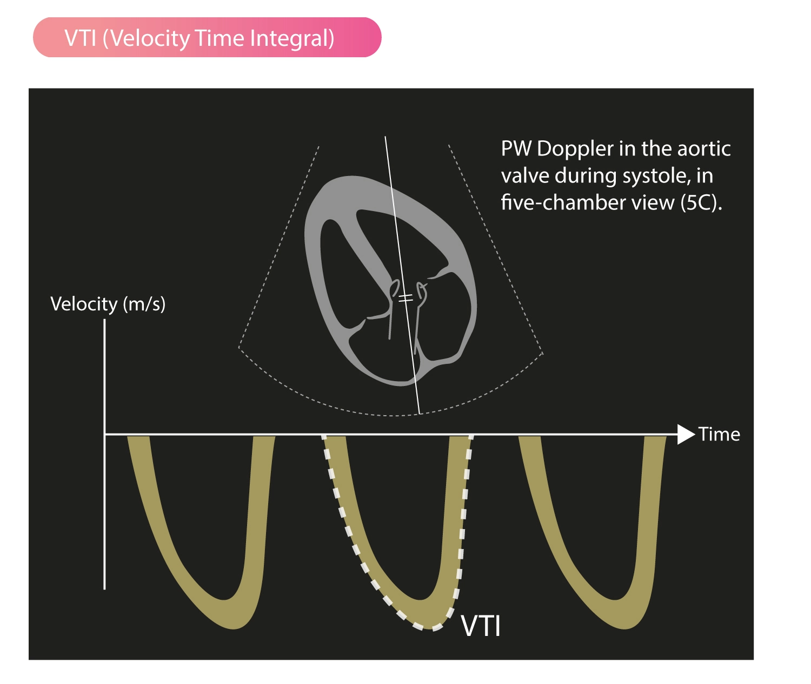

# Background
VTI is a hemo-dynamic echo parameter measured from Doppler spectrum  across the valves, *usually* in the LVOT. This parameter can be used to calculate cardiac output at the LVOT:
$$
SV = Area_{LVOT} \times VTI
$$
$$
SV = \pi \times [\frac{LVOT}{2}]^{2} \times VTI
$$
$$
CO = SV \times HR
$$

# Measuring VTI
TTE view: **5-chamber apical view.** Align the LVOT in parallel to the ultrasound beam. Measure the PWD flow at the same level of the LVOT that you measured the [LVOT Diameter](LVOT%20Diameter.md) at.

# Interpretation of VTI
1. Measure the VTI.
2. Measure the [LVOT Diameter](LVOT%20Diameter.md) to determine the LVOT cross-section area.
3. Measure the heart rate.
4. Calculate cardiac output: [Online calculator](http://www.csecho.ca/wp-content/themes/twentyeleven-csecho/cardiomath/?eqnHD=echo&eqnDisp=svecho) or the US machine will automatically calculate it for you.

# References
1. [What is time velocity Integral ? (VTI ) | Dr.S.Venkatesan MD](https://drsvenkatesan.com/2014/09/30/what-is-time-velocity-integral/)
2. [Stroke Volume, VTI (Velocity Time Integral) & Cardiac Output – ECG & ECHO](https://ecgwaves.com/topic/stroke-volume-vti-velocity-time-integral-cardiac-output/)
3. [Measuring Cardiac Output with Echocardiography Made Easy - POCUS 101](https://www.pocus101.com/measuring-cardiac-output-with-echocardiography-made-easy/)
4. [Advanced Critical Care Ultrasound: Velocity Time Integral Before and After Passive Leg Raise--In Sepsis, When Is Enough (Fluids) Enough? EMRA](https://www.emra.org/emresident/article/vti/)
5. https://anesthesia.bidmc.harvard.edu/ADEL/documents/echo/Cardiac%20Output%20measurment%20with%20echocardiography.pdf