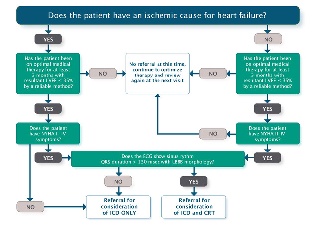

# Device Therapy for Heart Failure
See also [ICDs in the Post-ACS Period](../Arrhythmias/ICD%20Therapy.md#ICDs%20in%20the%20Post-ACS%20Period) for specific guidance peri-AMI ICD indications.

# ICD for Primary Prevention of SCD in HFrEF
Per the CCS HF Guidelines (2017):

- LVEF ≤35% and:
	- 3+ months of OMT
	- EF measured 1 month post-MI and 3 months post-revascularization otherwise
	- NYHA II-IV symptoms (class IV patients should NOT get ICD if not predicted to have improvement or are not candidates for more advanced device therapy).
- NYHA I symptoms for ischemic heart disease and EF < 30%

# CRT for Heart Failure
In select patients, CRT can reduce symptoms and mortality of HF. Can be combined with [ICD Therapy](../Arrhythmias/ICD%20Therapy.md) (i.e. CRT-D) if the ICD criteria are independently met.

1. **Major Indications for CRT:** NYHA II-IV symptoms on OMT >3 months; sinus rhythm; LBBB with QRS ≥130 ms; LVEF ≤35%.
2. **Consider CRT for the above but with:**
	1. QRS >150 ms and not LBBB;
	2. presence of AFib;
	3. elderly age or frailty;
	4. chronic RV pacing with reduced EF
3. If the QRS is narrow, then in this setting compared with ICD alone, CRT has not been associated with improvements in mortality or HF hospitalization, and there is a suggestion of increased harm with CRT in some studies.
