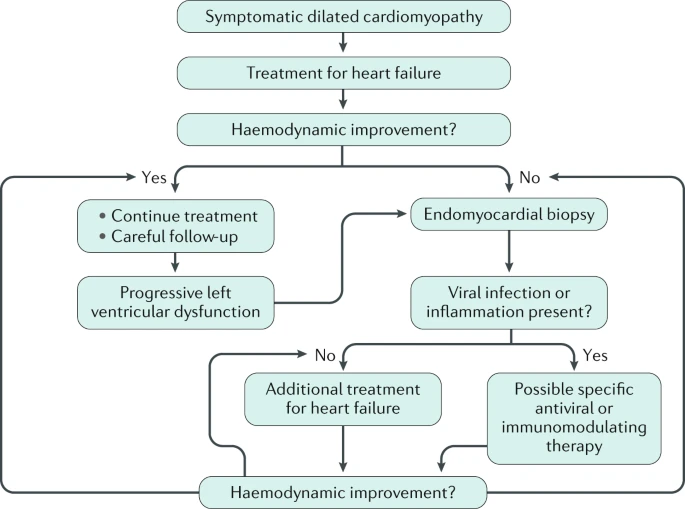

# Definition and Background
DCM is characterized by an enlarged LV (+/- RV) with systolic dysfunction, not caused by ischemic, valvular, hypertensive, congenital heart disease. One of the leading causes of heart failure (HF), DCM predominantly affects younger adults and is the most frequent indication for cardiac transplantation.

DCM can be classified as:
1) Genetic / familial
2) Nongenetic / mixed or acquired / nonfamilial

# Etiology
Diverse set of etiologies (and therefore, pathogenesis) of DCM. Idiopathic and familial diseases are the most common. Advances in genetic diagnostics are unveiling etiologies that would previously be classified as idiopathic.
- **Genetic mutations**  (most common)
- **Infection** (most common -- 30%). Typically associated with myocarditis.
	- Viruses, particularly the enteroviruses. Adenovirus, coronavirus, coxsackievirus, CMV, dengue, echovirus, EBV, HBV, HCV, HSV, HHV-6, HIV, Influenza, Mumps, Parvovirus B19, poliovirus, raviesvirus, RSV, rubella, measles, VZV
	- Bacteria: β-haemolytic streptococci, _Borrelia burgdorferi_, _Brucella_ spp., _Campylobacter jejuni_, _Chlamydia_ spp., _Clostridium_ spp., _Corynebacterium diphtheriae_, _Neisseria_ spp., _Haemophilus influenza_, _Legionella pneumophila_, _Listeria monocytogenes_, _Mycoplasma pneumoniae_, _Neisseria meningitidis_, _Salmonella_ (Berta and Typhi), _Streptococcus pneumoniae_, _Staphylococcus_ spp. and _Treponema pallidum_
	- Protozoa: _Entamoeba histolytica_, _Leishmania_ spp., _Plasmodium vivax_, _Plasmodium falciparum_, _Toxoplasma gondii_ and _Trypanosoma cruzi_
	- Helminths: _Taenia_ spp., _Echinococcus_ spp., _Schistosoma_ spp., _Toxocara_ spp. and _Trichinella_ spp.
	- Fungi: _Actinomyces_ spp., _Aspergillus_ spp., _Candida_ spp., _Coccidioides immitis_ and _Cryptococcus neoformans_
- **Autoimmunity** (most common): systemic sclerosis, RA, SLE, dermatomyositis, sarcoidosis, Dressler syndrome, post-cardiotomy syndrome, post-infectious autoimmune disease, post-radiation
- **Toxins**: **EtOH**, amphetamines, anthracyclines, cannabis, catecholamines, cocaine, 5-FU, lithium, heavy metals, carbon monoxide.
	- Chronic alcohol abuse is an important cause of DCM, occurring most often in men of 30–55 years of age who have been heavy consumers of alcohol for at least 10 years.
	- Depressed LV function has been reported in 4–9% of individuals who used cocaine and had cardiac symptoms
	- Anthracyclines that frequently cause DCM include doxorubicin, epirubicin and idarubicin. Doxorubicin: cumulative, dose-related, progressive myocardial damage. Doxorubicin binds both DNA and type II topoisomerase, leading to DNA double-stranded breaks and transcriptome changes resulting in mitochondrial dysfunction, reactive oxygen species generation and cardiac cell death.
- **Metabolic and endocrine dysfunction**: Cushing, thyroid, pheochromocytoma, hypocalcemia, hypophosphatemia, inborn errors of metabolism, thiamine and selenium deficiency, carnitine deficiency
- **Neuromuscular disease**: muscular and myotonic dystrophies, Friedreich ataxia
- **Pregnancy** and peripartum cardiomyopathy

## DCM Genetics
- several genes have been implicated in the development of DCM when mutated. Interrelationship between genes and environment is minimally studied; EtOH exposure facilitates the development of DCM in individuals with rare variants of DCM-associated genes
- **familial DCM** is defined when 2 closely related (1st/2nd degree) family members meet diagnostic criteria for idiopathic DCM. 15-30% of patients with DCM may be diagnosed with familial DCM if we screen their family members. Although a genetic basis for familial DCM is well established, most cases of DCM seem to be sporadic.

| Gene  | Protein                                       | Dilated cardiomyopathy cases (%) |
| ----- | --------------------------------------------- | -------------------------------- |
| TTN   | Titin                                         | 0.15–0.20                        |
| LMNA  | Prelamin A/C                                  | 0.06                             |
| MYH7  | Myosin 7                                      | 0.04                             |
| BAG3  | BAG family molecular chaperone regulator 3    | 0.03                             |
| TNNT2 | Troponin T, cardiac muscle                    | 0.03                             |
| FLNC  | Filamin C                                     | 0.02–0.04                        |
| RBM20 | RNA-binding protein 20                        | 0.02                             |
| SCN5A | Sodium channel protein type 5 subunit α       | 0.02                             |
| PLN   | Cardiac phospholamban                         | <0.01                            |
| TNNC1 | Troponin C, slow skeletal and cardiac muscles | <0.01                            |
| TNNI3 | Troponin I, cardiac muscle                    | <0.01                            |
| TPM1  | Tropomyosin-α1 chain                          | <0.01                            |

_TTN_ truncating mutations are a common cause of DCM, occurring in ~25% of familial cases of DCM and in 18% of sporadic cases.

# Epidemiology
In a 2013 review, the prevalence of DCM was estimated to be >1 per 250 individuals on the basis of recent clinical trial and related data; this result is particularly relevant as reliable population-based studies of the prevalence of [hypertrophic cardiomyopathy](../Hypertrophic%20Cardiomyopathy.md) have estimated it to be at least 1 per 500 individuals, and the review article estimates that DCM is at least as common in the population as [hypertrophic cardiomyopathy](../Hypertrophic%20Cardiomyopathy.md).

## Risk Factors
- 30% higher risk in Black than White individuals (not fully explained by [hypertension](../Hypertension.md) or socioeconomic factors)
- men > women by ~3:1

# Mechanisms and Pathophysiology
Animal models have demonstrated that LV dilatation results from remodelling and fibrosis. Similarly, in patients with DCM, there is evidence of scar tissue, with the left ventricle assuming a spherical shape. Pathophysiological changes include a decrease in stroke volume (blood volume pumped by the left ventricle at each contraction) and cardiac output (the amount of blood pumped by the heart per minute), impaired ventricular filling and an increase in end-diastolic pressure (the amount of blood in the ventricle when relaxed, which is a measure of dilation). Compensatory changes in the vascular system include an increase in systemic vascular resistance, a decrease in arterial compliance and an increase in venous pressure and circulating blood volume. Both cardiac preload (stretching of the heart wall before contraction) and afterload (the force needed for contraction to eject blood from the heart) are increased, with increased afterload resulting in elevated wall stress. Diastole involves both active relaxation (early diastole) and passive compliance (mid-to-late diastole). In DCM, diastolic dysfunction that affects both components can accompany a reduction in systolic function. Impaired ventricular relaxation results in reduced rapid ventricular filling.

# Clinical Diagnosis of DCM
## Clinical Heart Failure
The clinical presentation of DCM is generally unrelated to the underlying aetiology and ranges from dyspnoea, swollen legs, ankles and stomach, fatigue and chest pain caused by reduced oxygen levels reaching the heart to arrhythmia, acute decompensation or cardiogenic shock. The signs and symptoms of DCM mainly relate to the degree of LV or biventricular systolic dysfunction leading to pump failure; heart failure signs and symptoms may be fulminant, acute, subacute or chronic. In addition, atypical chest pain and palpitation may be present.

## Evaluation of DCM
### Echocardiography
Echocardiographic definition of DCM:
1) LV EDV/EDD > 2 SD from normal
2) LVEF < 45-50%

Rule out:
- coronary artery disease (?cardiac cath, [CCTA](../Ischemic%20Heart%20Disease/Diagnosis%20and%20Screening/Coronary%20CT%20Angiography.md))

### Electrocardiography and Holter
ECG can be normal, but patients can have isolated T wave changes, LBBB, IVCD. ST and SVT are common; 20-30% of patients have NSVT.

### Genetic and Family Screening
Idiopathic DCM --> consider a genetic etiology. The basic evaluation of these patients should include a detailed family history as well as clinical screening of first-degree relatives. Next-generation sequencing methods, such as whole-exome or whole-genome sequencing, are emerging as moderately inexpensive approaches for diagnosis that have both clinical and research implications. Even in the absence of an identified pathogenetic mutation, first-degree relatives should have periodic ECG and echocardiography to detect early signs of DCM.

### Cardiac MRI
Cardiac MRI is the the best method for morphological and functional evaluation and characterization of myocardial tissue in patients with DCM. Consider for patients with ?inflammation or fibrotic etiology.
- The presence of myocardial fibrosis can be detected with late gadolinium enhancement (LGE).
- MRI detects myocardial oedema suggestive of acute myocarditis or sarcoidosis
- low sensitivity tool

In DCM, the degree of fibrosis, marked by delayed gadolinium enhancement, is a predictor of all-cause mortality and need for future hospitalization.[33](https://www.ahajournals.org/doi/10.1161/circresaha.116.309396#R33) Specifically, delayed enhancement is associated with increased risk for ventricular arrhythmias.[34](https://www.ahajournals.org/doi/10.1161/circresaha.116.309396#R34)[–](https://www.ahajournals.org/doi/10.1161/circresaha.116.309396#R35)[36](https://www.ahajournals.org/doi/10.1161/circresaha.116.309396#R36) Delayed enhancement may also reflect features beyond fibrosis, including edema and inflammatory infiltrate.[37](https://www.ahajournals.org/doi/10.1161/circresaha.116.309396#R37)

### FGD-PET
FDG-PET is emergic as a valuable tool for the diagnosis of cardiac sarcoidosis.

### EMB
The current expert consensus statement of the ESC recommends that *all patients with suspected inflammatory cardiomyopathy should undergo an EMB* to identify the type of inflammatory infiltrate, to determine the underlying aetiology and form an aetiology-based treatment strategy. Several studies report that EMB can be performed with a very low rate of major complications and that LV biopsy is as safe as right ventricular biopsy. Tissue obtained from EMB should be analysed using histology, immunohistochemistry and molecular biology techniques.

# Management of DCM
- aims are to reduce HF symptoms and to improve cardiac function

## General Management of HF +/- rEF
- management is mostly NOT based primarily on DCM alone, but on evidence-base strategies to manage HFrEF. The pivotal randomized controlled clinical trials that provided the evidence for the guidelines on the treatment of heart failure with reduced ejection fraction included a large proportion of patients with a non-ischaemic aetiology (that is, individuals who probably developed heart failure as a result of DCM). Consequently, on the basis of subgroup analyses, it is reasonable to assume that the efficacy and safety of most treatments for heart failure extend to patients with DCM.
- See [GDMT](GDMT/Guideline-Directed%20Medical%20Therapy.md)
- 

## Etiology-Based Therapies
For patients with EMB-confirmed myocarditis or infection-associated DCM.
- consider immunosuppression in virus-negative EMB proven myocarditis
- consider antiviral therapies (IFN etc) with virus-positive EMB myocarditis. Enterovirus and adenovirus associated CM were shown to have benefit with IFN beta than placebo. 
- small studies have shown that immunoadsorption (removal of circulating autoAbs) improves cardiac function in these patients. Experimental therapy.

## Device Therapy
- CRT is indicated for patients with heart failure and LVEF ≤35% who have a life expectancy with good functional status of >1 year if they are in sinus rhythm and have a markedly prolonged QRS duration (≥130 ms) and an ECG that shows left bundle branch block, irrespective of symptom severity. The benefits of CRT for patients with right bundle branch block or interventricular conduction delay are unclear (subgroup analyses suggest little benefit or even harm
- An updated meta-analysis of six randomized trials, assessing the effect of [ICD](../Arrhythmias/ICD%20Therapy.md) on all-cause mortality in 2,970 patients with non-ischaemic DCM who were randomized to [ICD](../Arrhythmias/ICD%20Therapy.md) or to optimal medical therapy for the primary prevention of sudden cardiac death, found a significant 23% risk reduction in all-cause mortality in the [ICD](../Arrhythmias/ICD%20Therapy.md) arm

## Surgical Therapy
- considered for failure of adequate management to pharmacologic and device therapy. In this setting, surgical options are considered:
	- heart transplantation
	- long-term MCS implantation
	- +/- valve corrections

# Outcomes
Most causes of heart failure from DCM result from pump failure (70%), and SCD accounts for 30% of outcomes. The effect of medications, ventricular devices and heart transplantation on the natural history of DCM is not well characterized, and despite advances in the management of heart failure in patients with DCM, there is still substantial mortality.

Sudden cardiac death in DCM can be caused by electromechanical dissociation (pulseless electrical activity) or ventricular arrhythmias. The development of new LV branch block during follow-up is a strong independent prognostic predictor of all-cause mortality, and atrial fibrillation is a sign of structural disease progression and negatively affects the prognosis. Patients with DCM and haemodynamically relevant mitral regurgitation may need invasive therapies, such as percutaneous or open repair of the mitral valve, mechanical circulatory support or even heart transplantation. Whereas right ventricular function frequently recovers under therapy (typically within 6 months), the development of right ventricular dysfunction during long-term follow-up indicates structural disease progression and portends a negative outcome. Strategies to detect pre-symptomatic DCM have a clear rationale because early treatment can retard adverse remodelling, prevent heart failure symptoms and increase life expectancy. In addition, patients with DCM should be regularly re-assessed, particularly in the presence of cardiovascular risk factors. Worsening of LV function or an increased ventricular arrhythmic burden can be caused not only by DCM progression but also by the development of new co-pathologies. Thus, the possible presence of coronary artery disease, hypertensive heart disease, structural valve disease or acute myocarditis should be systematically ruled out during follow-up. However, clinical and echocardiographical parameters have limited ability to predict long-term prognosis, suggesting that other host–environmental factors are important in determining the outcome of DCM.

# References
1. [Braunwald’s Heart Disease: A Textbook of Cardiovascular Medicine](https://www-clinicalkey-com.libaccess.lib.mcmaster.ca/#!/browse/book/3-s2.0-C20191011278), 52, 1031-1051
2. [Dilated cardiomyopathy | Nature Reviews Disease Primers](https://www.nature.com/articles/s41572-019-0084-1)
3. [Dilated Cardiomyopathy | Circulation Research](https://www.ahajournals.org/doi/10.1161/circresaha.116.309396)
4. [The Diagnosis and Evaluation of Dilated Cardiomyopathy | Journal of the American College of Cardiology](https://www.jacc.org/doi/abs/10.1016/j.jacc.2016.03.590)
5. [Current Diagnostic and Treatment Strategies for Specific Dilated Cardiomyopathies: A Scientific Statement From the American Heart Association | Circulation](https://www.ahajournals.org/doi/10.1161/cir.0000000000000455#d1e1279)