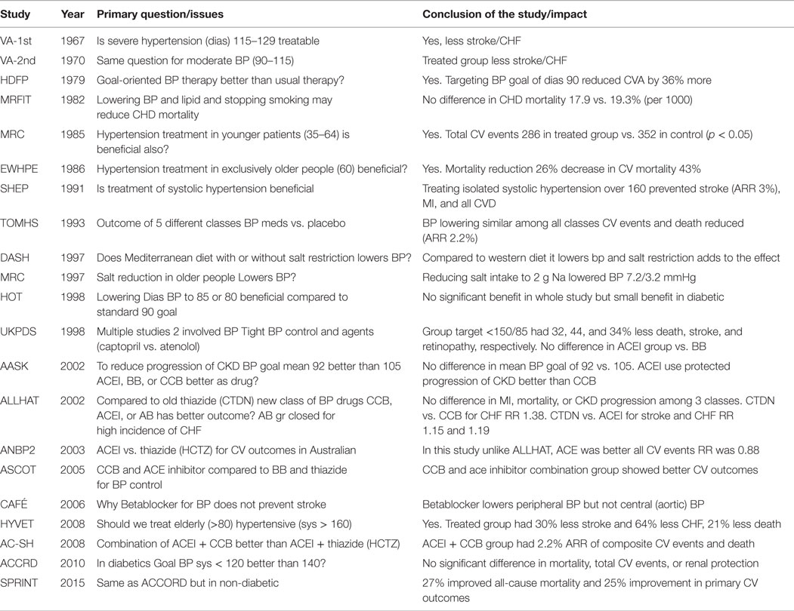

# Blood Pressure Thresholds and Targets for Pharm Therapy
| Population                 | Threshold                                  | Target    |
| -------------------------- | ------------------------------------------ | --------- |
| Macrovascular disease      | 140/90                                     | <140/90   |
| Diabetes                   | 130/80                                     | <130/80   |
| High risk (SPRINT)         | SBP 130 and other risk factors (see below) | SBP < 120 |
| [PKD](../Nephrology/Polycystic%20Kidney%20Disease%20(PKD).md)                    | HALT-PKD population                        | SBP < 95-110 |
| Non-SPRINT CKD             |                                            | SBP < 140 |
| History of spontaneous ICH |                                            | <130/80          |

> [!info] **SPRINT, or "High-Risk" Population:**
> SBP > 130 and one of:
> 1) Age 50+ with clinical or subclinical CVD, eGFR 20-60, proteinuria < 1 g/d, 10-year CV risk 15%+
> 2) Age 75+

# Pharmacotherapy
## First-Line Therapy
- Single-Pill Combinations (SPCs):
	- ACEi + CCB preferred.
	- ARB + CCB
	- ACE/ARB + diuretic
- Diuretics: long-acting TDs (chlorthalidone, indapamide) preferred over HCTZ
- ACE/ARB
- Long-acting CCB
- Beta-blockers (if young or with CVD)

## Second-Line Therapy
- add on drugs from the first-line choices:
	- thiazide + DHP-CCB
	- DHP-CCB + ACEi
- avoid:
	- ACE + ARBC
	- Dilt/verapamil + Beta blocker

## Specific Population Therapies
| Population | Recommendations                                                                                                                                      |
| ---------- | ---------------------------------------------------------------------------------------------------------------------------------------------------- |
| Diabetes   | ACE/ARB (especially with albuminuria or CKD), DHP-CCB, thiazide. If combination therapy with ACEi is needed, a DHP-CCB is preferred over a thiazide. |

# Lifestyle Interventions
| Intervention              | Recommendation                                                             |
| ------------------------- | -------------------------------------------------------------------------- |
| Exercise                  | 30-60 minutes, moderate intensity, 4-7 days weekly                         | 
| Weight                    | BMI 18.5-25, waist circumference <102 cm (M) <88 cm (F) for HTN prevention |
| Alcohol                   | Abstain from alcohol                                                       |
| Diet                      | DASH diet                                                                  |
| Salt intake               | <5 grams daily, <2 grams sodium                                            |
| Potassium supplementation | Consider if not at risk of hyperK                                          |
| Stress reduction          | CBT, relaxation, etc.                                                      |
| Smoking cessation         | Pharmacotherapy + counselling                                              |
| Ca++/Mg++ supplementation | None                                                                       |

# Major Hypertension Trials

## SHEP (1991)
## DASH (1997)
## ALLHAT (2002)
RCT to determine whether the occurrence of fatal CHD or nonfatal myocardial infarction ([MI](Ischemic%20Heart%20Disease/ACS.md)) is lower for high-risk patients with hypertension treated with amlodipine, lisinopril, doxazosin, or chlorthalidone.

Upon analysis of the data, the primary outcome, fatal coronary artery disease or nonfatal [MI](Ischemic%20Heart%20Disease/ACS.md) at 6 years, was similar among all groups. There was also no significant difference in all-cause mortality, a secondary outcome, among the groups.
- When comparing amlodipine with chlorthalidone, the amlodipine group had a 38% higher risk of heart failure (HF) (P<.001) and a 35% higher risk of hospitalized/fatal HF (P<.001).
- When comparing lisinopril with chlorthalidone, the lisinopril group had a 15% higher risk for stroke (P=.02), a 10% higher risk of combined cardiovascular disease (CVD) (p<0.001), a 19% higher risk of HF (P<.001), and an 11% higher risk of hospitalized/treated angina (P=.01).

As a result, **the authors of the study concluded that thiazide-type diuretics are superior in preventing CVD** and recommended that they be preferred for first-step antihypertensive therapy. Because of results from the study, the JNC 7 hypertension guidelines recommended that diuretics should be initiated in stage I hypertension.

## ACCOMPLISH (2008)
In patients with hypertension at high risk for cardiovascular complications, the combination of benazepril-amlodipine is superior to benazepril-hydrochlorothiazide in reducing cardiovascular events.

## ACCORD (2010)
In diabetic, is SBP < 120 better than < 140? No significant difference in mortality, total CV events, or renal protection.

## SPRINT (2015)
Among patients at high risk for cardiovascular events but without diabetes, intensive blood pressure control to a target SBP <120 mmHg improves cardiovascular outcomes but increases the rates of some adverse events.

# Secondary Hypertension
## Causes
1. [Renovascular Hypertension](../Nephrology/Renovascular%20Hypertension.md)
2. Endocrine (pheochromocytoma, thyroid disease)
3. [Primary hyperaldosteronism](../Endocrinology/Primary%20hyperaldosteronism.md)
4. [Obstructive Sleep Apnea](../Respirology/Obstructive%20Lung%20Disease/Obstructive%20Sleep%20Apnea.md)

# References
1. [5 Blood Pressure Studies Pharmacists Should Know About](https://www.pharmacytimes.com/view/5-blood-pressure-studies-every-pharmacist-should-know)
2. [Frontiers | Timeline of History of Hypertension Treatment](https://www.frontiersin.org/articles/10.3389/fcvm.2016.00003/full)
3. Hypertension 2020 Guidelines
4. IM Review 2021 - Nephrology Slides 