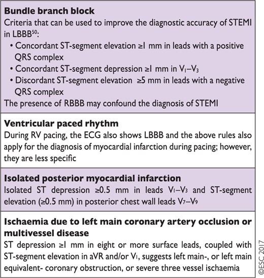
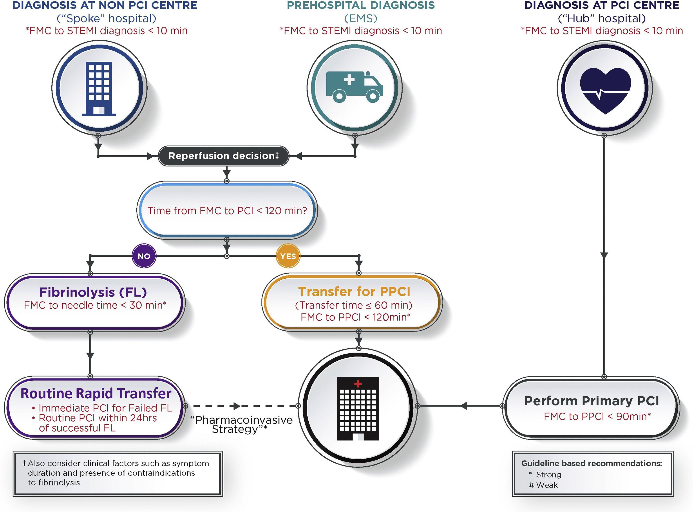
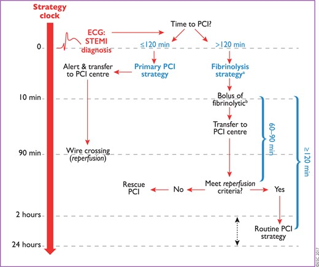
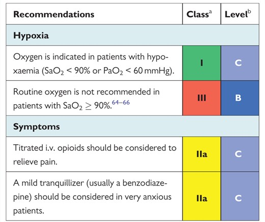
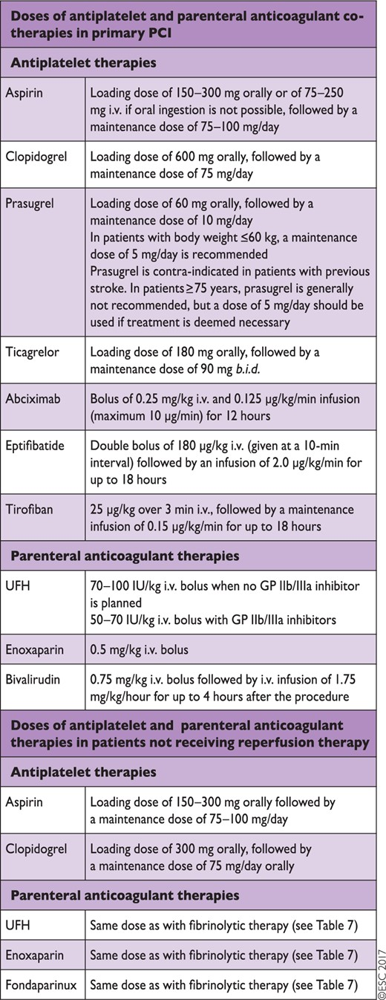
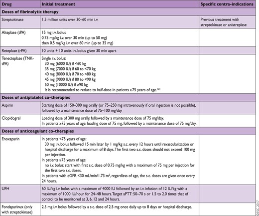
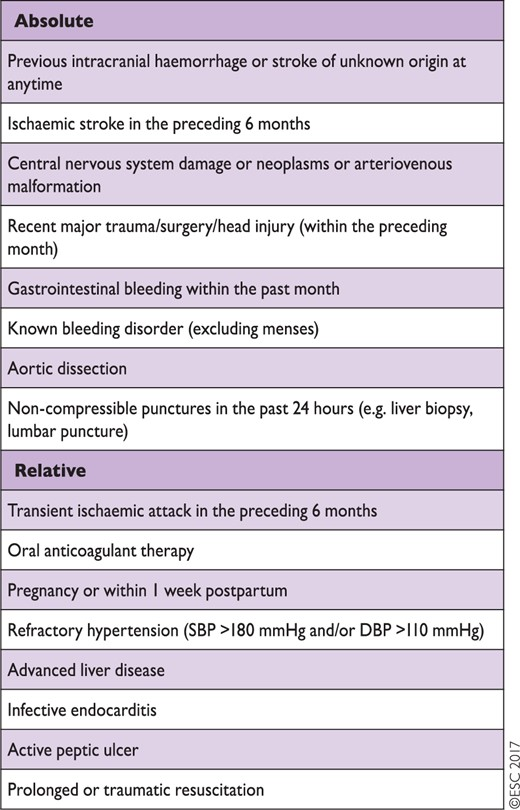
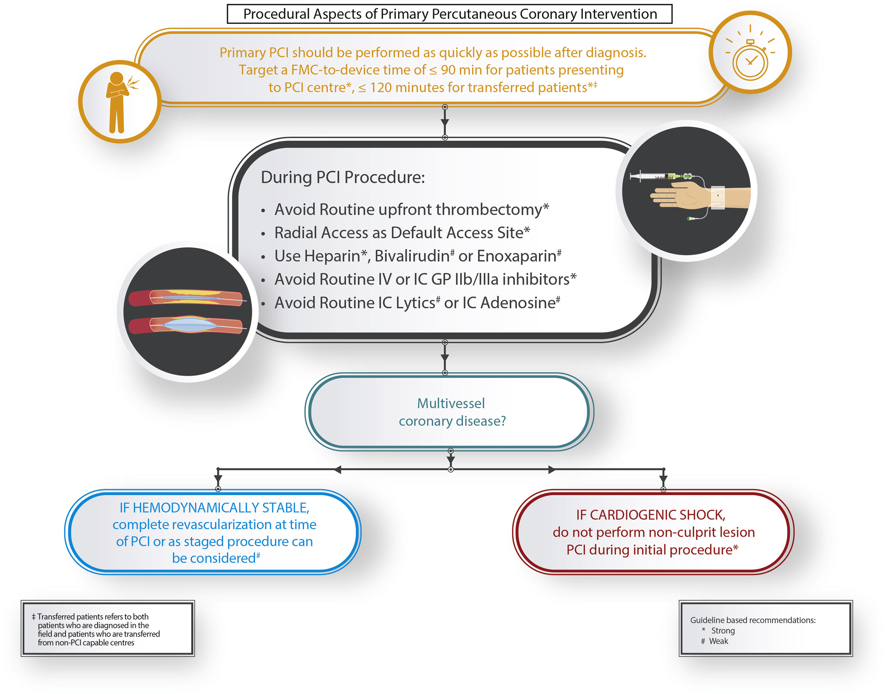

# STEMI
# Definitions/Diagnosis
- **Classically, STEMI: ST-segment elevation in at least two contiguous leads + ACS:**
	- at least two contiguous leads with ST-segment elevation ≥ 2.5 mm in men < 40 years, ≥2 mm in men ≥ 40 years, or ≥ 1.5 mm in women in leads V2–V3 and/or ≥ 1 mm in the other leads (in the absence of left ventricular (LV) hypertrophy or left bundle branch block)
	- with inferior MI, it is recommended to record right precordial leads (V3R and V4R) seeking ST-segment elevation, to identify concomitant right ventricular (RV) infarction
	- ST-segment depression in leads V1–V3 suggests myocardial ischaemia, especially when the terminal T-wave is positive (ST-segment elevation equivalent), and confirmation by concomitant ST-segment elevation ≥ 0.5 mm recorded in leads V7–V9 should be considered as a means to identify posterior MI.
- **Consider the following patterns as STEMI-equivalents in the right clinical setting:**
	- 

# STEMI Flow

1. Time from first medical contact to Primary PCI should be **<120 minutes** if the diagnosis is made out of hospital or at a non-PCI centre.
2. Time from first medical contact to primary PCI should be **<90 minutes** at a PCI centre

## Reperfusion Treatment Goals
| Metric                                                                                                                   | Goal∗         |
|--------------------------------------------------------------------------------------------------------------------------|---------------|
| FMC to diagnosis (ECG acquisition and interpretation)                                                                    | ≤ 10 minutes  |
| Diagnosis to catheterization lab activation                                                                              | ≤ 10 minutes  |
| Door-in to door-out time for emergency departments                                                                       | ≤ 30 minutes  |
| Transport times for interfacility transfers or STEMI patients diagnosed in the field                                     | ≤ 60 minutes  |
| Time from arrival at catheterization lab to first device activation                                                      | ≤ 30 minutes  |
| Total time from FMC to first device activation (for primary PCI); for non-PCI centres or patients diagnosed in the field | ≤ 120 minutes |
| Total time from FMC to first device activation (for primary PCI); for patients presenting to PCI centres                 | ≤ 90 minutes  |
| Time from FMC to fibrinolysis                                                                                            | ≤ 30 minutes  |
| Time from fibrinolysis to coronary angiography                                                                           | < 24 hours    |

# Pre-Hospital/Non-PCI Centre Care
1. Reperfusion:
	1. **Consider transfer for PPCI  if possible <120 minutes**
	2. Otherwise, **strongly consider fibrinolysis within 30 minutes door-to-needle time.** Fibrinolysis given within 12 hours of symptom onset significantly reduces mortality for STEMI. However, it has been estimated that 1.6 lives per 1000 patients treated are lost for every 1 hour of delay in administering fibrinolytic therapy. A half dose of fibrinolytic therapy may be considered for patients undergoing a pharmacoinvasive strategy who are older than 75 years of age.
	3. For patients with a contraindication to fibrinolysis, transfer for PPCI should be initiated even if the FMC-to-device time is expected to be > 120 minutes.
2. Oxygen if hypoxic
3. Sparing use of opioid medications
4. ASA: for all patients
5. P2Y12 inhibitors: not routinely given in EMS, consider in ER or in the cath lab ASAP prior to coronary angiography.

# Approach to Acute Management of STEMI (PCI-Centre)
## Initial Care

- treat cardiac arrest if present - consider empiric PCI in OHCA with high suspicion of cardiac event as index trigger

## Pharmacotherapy
- Patients undergoing primary PCI should receive DAPT, a combination of aspirin and a P2Y12 inhibitor, and a parenteral anticoagulant.
	- **ASA 150-300 mg PO**
	- **P2Y12 inhibition**
		- Prasugrel 60 mg loading dose and 10 mg maintenance dose once daily -- contraindicated in prior stroke/TIA, oral anticoagulation, and moderate-severe liver disease.
		- Ticagrelor 180 mg loading dose and 90 mg BID maintenance - contraindicated in prior hemorrhagic stroke, oral anticoagulation, and moderate-severe liver disease.
		- Clopidogrel. *A higher regimen of a 600 mg loading dose/150 mg maintenance dose in the first week was superior to the 300/75 mg regimen* in the subset of patients undergoing PCI in the CURRENT-OASIS 7 trial.
		- There is limited evidence with respect to when the P2Y12 inhibitor should be initiated in STEMI patients. However, the data suggest that the earliest administration may be preferable to achieve early efficacy, particularly for long delays. In cases in which the STEMI diagnosis is not clear, delaying P2Y12 inhibitor loading until the anatomy is known should be considered.
	- there is no evidence to recommend the routine use of GP IIb/IIIa inhibitors for primary PCI
	- Anticoagulant options for primary PCI include UFH, enoxaparin, and bivalirudin. Use of fondaparinux in the context of primary PCI was associated with potential harm in the Organization for the Assessment of Strategies for Ischemic Syndromes 6 (OASIS 6) trial and is not recommended. *Routine use of UFH is recommended.*

### Fibrinolysis

Contraindications to fibrinolysis:

## Primary PCI
Primary PCI is the preferred reperfusion strategy in patients with STEMI within 12 h of symptom onset. Lower mortality rates among patients undergoing primary PCI are observed in centres with a high volume of PCI procedures.

1. More rapid reperfusion is associated with lower mortality rates. Therefore, target in Canada is FMC to device time of <= 90 minutes.
2. **Multivessel (defined as a significant stenosis in at least 1 nonculprit vessel) vs culprit-only PCI in STEMI without CS**
	1. No cardiogenic shock --> consider complete revascularization vs staged procedure.
3. **Multivessel disease vs culprit-only PCI in STEMI with CS**
	1. Cardiogenic shock --> primary culprit-only revascularization.
	2. The **CULPRIT-SHOCK** trial showed that culprit lesion-only PCI vs multivessel PCI led to lower rates of death/RRT or death alone, although repeat revascularization rates were higher.
4. **Thrombectomy** is NOT routinely recommended. Consider bailout thrombectomy only when there is a high residual thrombus burden post balloon angioplasty/stenting.
	1. Trials: TOTAL, TAPAS, TASTE
	2. Summary: absence of any clear benefit in clinical end points in the 2 largest randomized trials, and the possibility of increased stroke with thrombectomy observed in the largest trial
5. **Radial access preferred** due to STEMI-RADIAL, RIFLE-STEACS, RIVAL, ACUITY, MATRIX trials showing that on the whole, transradial access (TRA) vs transfemoral access (TFA) is associated with lower bleeding and access site complications, lower cardiac death and stroke risk.
6. **Adjunctive medications**
	1. antithrombotic agents - options are *UFH, enoxaparin, bivalirudin*. Studies support the use of I.V. UFH at a dose of 70-100 units per kilogram body weight for periprocedural anticoagulation targeting an activated clotting time of 200-300 seconds with GP IIb IIIa inhibitor or ≥ 300 seconds without GP IIb IIIa inhibitors
	2. Low-dose IC fibrinolysis might be considered in selected cases to treat large-burden residual thrombus during PPCI.
	3. IC adenosine may be considered for the selective treatment of no reflow during PPCI.

## Secondary PCI
- After fibrinolysis, transfer to a PCI centre for routine early PCI: *We recommend routine rapid transfer to PCI centres after fibrinolysis, immediate PCI for patients with failed reperfusion, and routine angiography with or without PCI within 24 hours after successful fibrinolysis (Strong Recommendation, Moderate-Quality Evidence).*
- Rescue PCI is indicated in the case of failed fibrinolysis (i.e. ST-segment resolution < 50% within 60–90 min of fibrinolytic administration), or in the presence of haemodynamic or electrical instability, worsening ischaemia, or persistent chest pain.

# Management During Hospitalization and at Discharge
1. **Admit to CCU/ICU for monitoring**. Continuous monitoring for 24 hours after symptom onset at the minimum, consider longer for higher risk patients.
2. **Early ambulation** (Day 1) in the majority of patients is recommended.
3. **Early discharge** after STEMI can be assessed using criteria (PAMI-II, Zwolle PPCI Index, etc). Low-risk patients with successful primary PCI and complete revascularization can safely be discharged from hospital on day 2 or day 3 after PCI. Early (i.e. same day) transfer to a local hospital following successful primary PCI is routine practice.

# References
1. [2017 ESC STEMI Guidelines](https://academic.oup.com/eurheartj/article/39/2/119/4095042)
2. [Cardiac Care Network (Ontario) ED STEMI Algorithm](https://www.corhealthontario.ca/STEMI-Algorithm-Poster-18x24.pdf)
3. [2019 CCS STEMI Guidelines](https://www.onlinecjc.ca/article/S0828-282X(18)31321-7/fulltext)