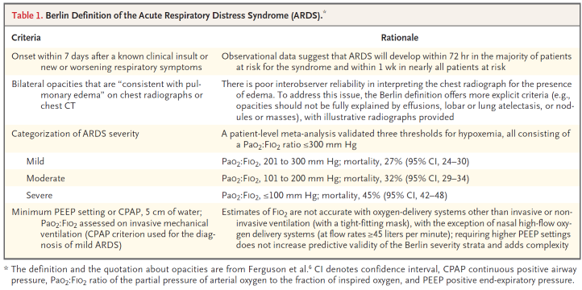
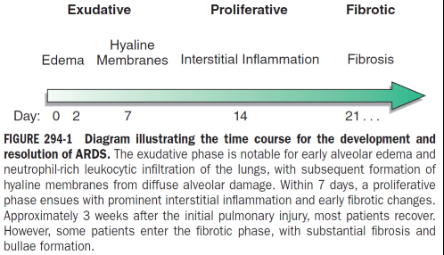

# ARDS
## Definition
**Berlin definition (2012)** establishes the definition and three risk strata (mild, moderate, severe ARDS) based on the degree of hypoxemia as assessed at a minimum PEEP. These stages are associated with mortality risk and duration of mechanical ventilation.

## Stages of ARDS

> [!info] Exudative phase (7 days)
> - Pathology: Alveolar capillary and type I pneumocyte damage, loss of alveolar barrier to fluid and macromolecules. Accumulation of exudative protein-rich fluid. Pro-inflammatory cytokine action, Recruitment of leukocytes, Hyaline membrane formation from protein deposition. Vascular obliteration from microthrombi etc. leads to dead space and pulmonary hypertension  and hypercapnia.
> - Classically affects dependent areas of the lung. Decreased lung compliance --> shunting --> hypoxemia --> work of breathing --> SOB.
> - Clinically:
> 	- First 7 days of illness after exposure to ARDS risk factor. Symptoms usually develop within 1.5 days, but can be delayed up to a 1 week. Presents with SOB, +WOB. Nonspecific laboratory values. 
> 	- CXR --> pulmonary edema, usually at least 3/4 of lung fields. DDx cardiogenic pulmonary edema. May not demonstrate cardiomegaly, pleural effusions, pulmonary vascular redistribution.

> [!info] Proliferative phase (days 7 to 21)
>  *   Pathology:
 >       *   Initiation of lung repair, organization of exudates, and lymphocytic infiltration
 >       *   Proliferation of type II pneumocytes
>    *   Clinically:
> 	  *   Most patients recover quickly and are liberated from mechanical ventilation in this phase.
> 	   *   Residual SOB, tachypnea, and hypoxemia are common
> 	   *   Progressive lung injury and early fibrosis can occur

> [!info] Fibrotic phase (weeks 3 to 4)
>    *   Pathology:
>        *   Conversion of alveolar edema and exudates --> alveolar-duct and interstitial fibrosis
 > 	      *   Development of emphysema-like changes with large bullae
> 		 *   Progressive vascular occlusion and pulmonary hypertension
 >   *   Clinically,
 > 	  * Some patients may enter this phase after about 3-4 weeks after injury
 > 	  * **Increased risk of PTX and mortality**

## General Principles of ARDS Management
*   **Excellent overall critical care management** of these patients, underlying medical and surgical disorders, minimizing procedures and iatrogenic complications, standard "bundled care" (VTE ppx, GIB ppx, PADIS, CLABSI)
*   **Recognition of nosocomial infection**
*   **Adequate nutrition** via enteral route = when feasible

| Care facet                   | Routine recommendations                                                          |
| ---------------------------- | -------------------------------------------------------------------------------- |
| Mechanical Ventilation       | Low tidal volume, low pressure, high PEEP, minimize FiO2, optimize PaO2          |
| Proning                      | Do in severe ARDS                                                                |
| ECMO                         | Rescue therapy                                                                   |
| Fluid Management             | Minimize LA filling pressures aggressively using fluid restriction and diuretics |
| Early [Neuromuscular Blockade](../Procedures/Neuromuscular%20Blockade.md) | Do not routinely do                                                              |
| Steroids                     | Do not routinely give                                                            |

> [!NOTE] Jasper's Escalating ARDS Approach. Continue down the list if the patient is refractory or meets indications (generally based off oxygenation/P:F ratio).
> 1. Lung-protective ventilation, all patients
> 	1. Low tidal volumes
> 	2. Low plateau pressures
> 	3. Optimization of PEEP/FiO2
> 	4. Light sedation
> 2. Minimize fluid balance, all patients
> 3. Steroids (dexamethasone has the most evidence), PF < 200
> 4. Prone, PF < 150
> 5. Deepen sedation (particularly if asynchronous)
> 6. Paralyze, only in deep sedation
> 7. ECLS consideration

## Mechanical Ventilation in ARDS
In general, these patients require mechanical ventilation due to increased WOB and progressive hypoxemia.

### Minimizing Ventilator-Induced Lung Injury
> [!INFO] Key Trial
> **ARDSNet** changed practice towards low-volume and low-pressure ventilation.

Injury can arise from "volutrauma", "atelectrauma" which lead to inflammation and alveolar injury. **Low VT ventilation (6 mL/kg PBW) and low airway pressures (Pplateau < 30 cm H2O)** were shown in **ARDSNet** to reduce mortality by 40%, and these strategies are now commonly used/standard of care.

### Optimize PEEP
Reduced compliance means that end-expiration alveolar collase can occur without increases in end-expiratory pressures. **Increase/optimize PEEP to minimize FiO2 and optimize PaO2**, there is no consensus on how to do this. See [Optimizing PEEP](../Mechanical%20Ventilation/Optimizing%20PEEP.md) for more details.

### Prone Positioning
Only one major trial has been conducted that looks at proning as a strategy in ARDS. Theoretically this improves V:Q mismatch by improving airflow to the most perfused areas of the lung (basilar segments), reduces work of breathing by respiratory muscles, and improves compliance (reduced diaphragmatic pressures on the lungs).

> [!abstract] PROSEVA (2013)
> - In severe ARDS (PF < 150), early prolonged proned positioning decreases 28 and 90 day mortality by 60% and by 56% respectively as compared to semirecumbent "supine" positioning.
> - Earlier studies show this also improves arterial oxygenation (PaO2)

### Other Strategies in Mechanical Ventilation
*  **Recruitment maneuvers** and the concept of "**open lung ventilation**" can increase PEEP and oxygenation but have not been shown to reduce mortality.
    *   ART trial (2017)
    *   PHARLAP (2019)
*  **Alternate ventilation modes** such as APRV and HFOV have not proven beneficial in ARDS.
*   **ECMO** improves mortality and may serve as rescue therapy (conventional view), but newer trials and evidence suggest that it may serve also as an adjunct to early refractory very severe ARDS (i.e. PF < 80) -- see [ECLS for ARDS](ECLS%20for%20ARDS.md).

## Steroids in ARDS
Based on the 2017 and 2019 guidelines for ARDS, few studies have shown significant mortality benefit. **They not support the routine use of glucocorticoids** in ARDS.

However, in 2020 the ARDSNet group published the first dexamethasone trial of ARDS, the **DEXA-ARDS** trial, in the Lancet. This study showed that in early moderate to severe ARDS (PF < 200 despite PEEP 10+ and FiO2 50%+), ten days of dexamethasone (20 mg for five days then 10 mg for five days) in addition to lung-protective ventilation decreased 60-day mortality by 15% absolute difference (21% vs 36%), increased ventilator-free days at 28 days by 4.8 days. Less proning was needed for dexamethasone arm. There were no significant adverse effects compared to control with respect to hyperglycemia, new infections in the ICU, or barotrauma. N=277, and this trial was stopped early for efficacy.

> [!abstract] DEXA-ARDS (2020)
> - In moderate to severe ARDS, 10 days of dexamethasone reduces mortality by 15% absolute risk (NNT = 6), and increases ventilator-free days within 28 days by 5 days on average.
> - Adverse events are not worse than control
> - Their regimen (not particularly an evidence-based area) was dexamethasone 20 mg daily x 5 days then 10 mg daily x 5 days

## Oxygen Targets in ARDS
Conventional oxygenation targets for ICU patients is a changing field, and current evidence (see [Oxygen Targets in the ICU](../Mechanical%20Ventilation/Oxygen%20Targets%20in%20the%20ICU.md)) suggest a conservative target (PaO2 70-100 mmHg; SpO1 90-96%) as opposed to more liberal targets, using the minimum FiO2 required, for most intubated critically ill patients. 

The **LOCO2 (2020)** RCT in NEJM specifically looked at patients with ARDS and compared oxygenation targets of PaO2 55-70 mmHg vs. 90-105 mmHg, or their equivalent saturations (SpO2 88-92% vs. 96%+).
- Trend towards increased mortality (34.3% vs 26.5%) in the conservative group, nonsignificant.
- Increased number of episodes of mesenteric ischemia in the conservative oxygen group.

> [!NOTE] SUMMARY: Oxygen targets in ARDS
> - Based on the available evidence (ICU-ROX, OXYGEN-ICU, LOCO2), both hypoxia and hyperoxia should be avoided in ARDS specifically.
> - Lower limit: SpO2 90%, PaO2 60-70 mmHg
> - Upper limit: SpO2 96%, PaO2 100-105 mmHg
> - minimize FiO2 to achieve oxygenation in this range
> - benefits of this might include lower mortality, lower ischemic events

## Fluid Management in ARDS
Propensity to have increased interstitial and alveolar protein-rich fluid that worsens inflammation and oxygenation. **Maintain low left atrial filling pressure** to minimize pulmonary edema, preserve oxygenation and lung compliance, improve pulmonary mechanics, shorten ICU stay and duration of mechanical ventilation

The **FACTT trial** ("Comparison of Two Fluid-Management Strategies in Acute Lung Injury") suggests that conservative fluid management (i.e., net-neutral) compared to liberal-strategy (+ 1 litre per day on average) improves lung functional and shortens mechanical ventilation and critical care, without increasing non-pulmonary organ failure.

The 2006 Fluids and Catheters Treatment Trial (FACTT) sought to define the optimal fluid management strategy in ALI/ARDS. It randomized 1,000 patients with ALI/ARDS to liberal (CVP 10-14) or conservative (CVP <4) fluid management strategies. At 60 days, there was no difference between the two groups in mortality. However, the conservative therapy was associated with a decreased days on a ventilator and time in the ICU.

*   _Fluid restriction_
*   _Diuretics_
*   _Limited only by hypotension and end-organ hypoperfusion_

## [Neuromuscular Blockade](../Procedures/Neuromuscular%20Blockade.md) in ARDS
See [Neuromuscular Blockade](../Procedures/Neuromuscular%20Blockade.md).

In severe ARDS, sedation alone can be inadequate for the patient-ventilator synchrony required for lung-protective ventilation.

*   **ACURASYS (2010)** showed a mortality and ventilation-dependence benefit with 48h of cisatracurium in severe ARDS.
*   **ROSE (2019)** demonstrated that this approach in conjunction with modern light sedation protocols did not reduce mortality, and was associated with an increase in ICU-acquired weakness and serious adverse cardiovascular events.

Therefore, **do not routinely use [Neuromuscular Blockade](../Procedures/Neuromuscular%20Blockade.md) for severe ARDS.**

## Other Therapies

*   **Pulmonary surfactants** not shown to work.
*   **Pulmonary vasodilators** such as inhaled NO, not shown to work.

## References
1.  Harrison's Chapter 294 on ARDS
2.  Fernando SM, Ferreyro BL, Urner M, Munshi L, Fan E. Diagnosis and management of acute respiratory distress syndrome. CMAJ \[Internet\]. 2021 May 25 \[cited 2021 Dec 8\];193(21):E761–8. Available from: [https://www.cmaj.ca/content/193/21/E761](https://www.cmaj.ca/content/193/21/E761)
3.  Papazian L, Aubron C, Brochard L, Chiche J-D, Combes A, Dreyfuss D, et al. Formal guidelines: management of acute respiratory distress syndrome. Annals of Intensive Care \[Internet\]. 2019 Jun 13 \[cited 2021 Dec 8\];9(1):69. Available from: [https://doi.org/10.1186/s13613-019-0540-9](https://doi.org/10.1186/s13613-019-0540-9)
4.  Griffiths MJD, McAuley DF, Perkins GD, Barrett N, Blackwood B, Boyle A, et al. Guidelines on the management of acute respiratory distress syndrome. BMJ Open Respiratory Research \[Internet\]. 2019 May 1 \[cited 2021 Dec 8\];6(1):e000420. Available from: [https://bmjopenrespres.bmj.com/content/6/1/e000420](https://bmjopenrespres.bmj.com/content/6/1/e000420)
5.  Fan E, Del Sorbo L, Goligher EC, Hodgson CL, Munshi L, Walkey AJ, et al. An Official American Thoracic Society/European Society of Intensive Care Medicine/Society of Critical Care Medicine Clinical Practice Guideline: Mechanical Ventilation in Adult Patients with Acute Respiratory Distress Syndrome. Am J Respir Crit Care Med \[Internet\]. 2017 May 1 \[cited 2021 Dec 8\];195(9):1253–63. Available from: [https://www.atsjournals.org/doi/full/10.1164/rccm.201703-0548ST](https://www.atsjournals.org/doi/full/10.1164/rccm.201703-0548ST)
6.  Guérin C, Reignier J, Richard J-C, Beuret P, Gacouin A, Boulain T, et al. Prone Positioning in Severe Acute Respiratory Distress Syndrome. New England Journal of Medicine \[Internet\]. 2013 Jun 6 \[cited 2021 Nov 29\];368(23):2159–68. Available from: [https://doi.org/10.1056/NEJMoa1214103](https://doi.org/10.1056/NEJMoa1214103)
7.  Slutsky AS, Marco Ranieri V. Mechanical ventilation: lessons from the ARDSNet trial. Respir Res \[Internet\]. 2000 \[cited 2021 Nov 29\];1(2):73–7. Available from: [https://www.ncbi.nlm.nih.gov/pmc/articles/PMC59545/](https://www.ncbi.nlm.nih.gov/pmc/articles/PMC59545/)
8.  Ventilation with Lower Tidal Volumes as Compared with Traditional Tidal Volumes for Acute Lung Injury and the Acute Respiratory Distress Syndrome. New England Journal of Medicine \[Internet\]. 2000 May 4 \[cited 2021 Nov 29\];342(18):1301–8. Available from: [https://doi.org/10.1056/NEJM200005043421801](https://doi.org/10.1056/NEJM200005043421801)