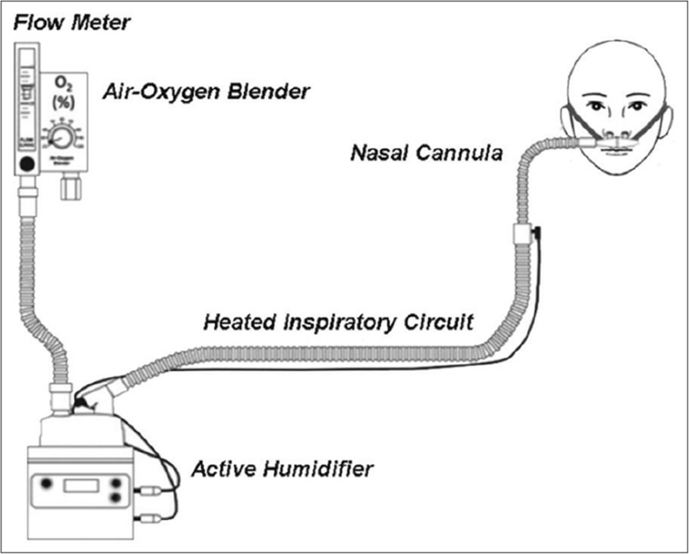

# High-Flow Nasal Cannula
HFNC is characterized as a "high-flow" device because it provides flow at or above the peak inspiratory flow rate (for most patients in most situations), so that the FiO2 can be tightly controlled as the patient will not exceed the provided flow and entrain room air. In fact, this is the definition of "high-flow" devices.

HFNC provides the following benefits over conventional oxygen therapy:

1. Decreases anatomic dead space as it avoids CO2 rebreathing by washing out the upper airways
2. Increases FiO2 by
	1. providing high-flow higher FiO2 air
	2. creates a reservoir of high FiO2 air in the pharynx which highly oxygenates the first part of one's death
3. Titratable FiO2
4. Can be heated/humidified to optimize comfort and mucociliary clearance/hydration status
5. Able to eat
6. Provides a small amount of PEEP

## Evidence Base
The [FLORALI trial (NEJM 2015)](http://www.nejm.org/doi/full/10.1056/NEJMoa1503326) showed that high-flow nasal cannula can reduce 90-day mortality in patients with nonhypercapnic acute hypoxemic respiratory failure compared to noninvasive ventilation or standard oxygen therapy.

- 12%  (HFNC) vs 28% (NIV) vs 23% (standard oxygen therapy) 90-day mortality rates
- reduction in [intubation](../Procedures/Intubation.md) rates in patients with more severe hypoxemia (PF < 200)

[SRMA in 2019 by Dr. Rochwerg](https://pubmed.ncbi.nlm.nih.gov/30888444/): HFNc reduces [intubation](../Procedures/Intubation.md) rates compared to conventional oxygen but does not affect ICU death or LOS.

In COVID, not much prospective randomized evidence exists:

- [SOHO-COVID](https://jamanetwork-com.libaccess.lib.mcmaster.ca/journals/jama/fullarticle/2796693) shows that HFNC does not affect mortality compared to standard oxygen therapy in COVID