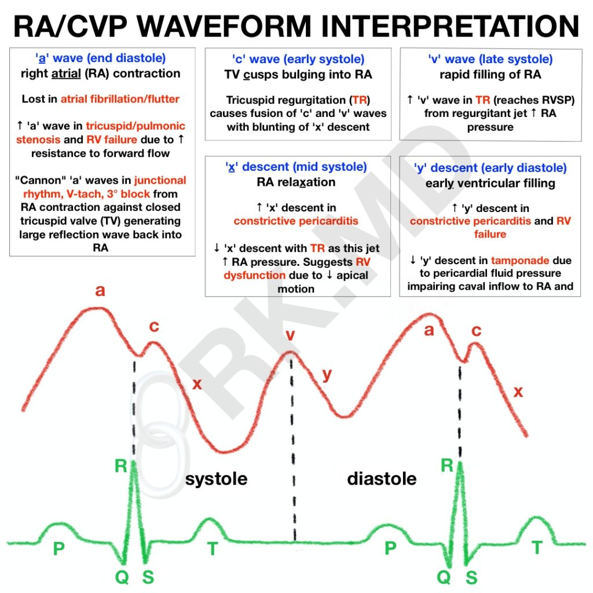

# Right Atrial Pressure in the Critically Ill
> Magder S. Right Atrial Pressure in the Critically Ill: How to Measure, What Is the Value, What Are the Limitations? CHEST [Internet]. 2017 Apr 1 [cited 2022 Oct 10];151(4):908–16. Available from: [https://journal.chestnet.org/article/S0012-3692(16)62283-3/abstract](https://journal.chestnet.org/article/S0012-3692(16)62283-3/abstract)

## Introduction
- RAP, or its surrogate CVP, is determined by the interaction between cardiac function and venous return function. Its dynamic observation can give us insight into
	- right sided cardiac diastolic function
	- tricuspid valve function
	- volume responsiveness
	- cardiac rhythm

## What determines RAP and CVP?
- RAP ~= CVP for central veins (not the femoral) and when there isn't constriction between the catheter and the RA.
- RAP is determined by the interaction of cardiac function and venous return:
	- cardiac function (HR, preload, afterload, contractility)
	- venous return ("stretched" vascular volume, venous compliance, venous resistance, downstream CVP). The heart effects venous return primarily by lowerig the RAP.
- the normal pressure difference from the upstream venous reservoir to the heart is only 4-8 mmHg, and small measurement errors can have important clinical consequences

## CVP Status
- Elevated:
	- decreased cardiac function + normal or moderately elevated blood volume
	- high venous return due to elevated blood volume
	- decreased venous resistance without matching rise in cardiac function (e.g. distributive shock)
- Low/Zero
	- Normal state
	- hypovolemia
	- increased venous resistance
	- hyperdynamic cardiac function

CVP, by itself, is not a useful marker of volume status, and in isolation is not a strong predictor of fluid responsiveness.

## Technicalities
### Methods
- **JVP** is a physical examination maneuver that estimates the CVP:
	- Technique: measure the height of the venous distension above the sternal angle. On average, the midpoint of the RA is 5cm vertically below the sternal angle (regardless of sitting angle). Measure from the base of the pulsations seen, not the top.
	- Conversion: measurement in cm H2O / 1.36 = mm Hg. For example, JVP of 10 cm above the RA estimates a RAP of 7 mmHg.
- **CVC transduction** can measure the CVP better by transducing a column.
- **Ultrasound** can measure the CVP by looking at the level of collapse in the jugular veins.

### Considerations for Catheter Transducing
Pay attention to the three following issues:

1. **Zeroing** - standard zero is atmospheric pressure. Open the transducer to air and zeroing it. It is approximately 760 mmg under standard conditions.
2. **Calibration** - automated.
3. **Leveling** - the transducer needs to be leveled to a physiologic reference point in order to make sense.
	1) In studies, the point is the middle of the RA or the mid-TV and this is done by setting the transducer 5 cm below the sternal angle.
	2) Realistically, the point is the mid-axillary line at the 4th ICS because no measuring device is required. This should only be used supine.
	3) The difference between these methods is about 3 mm Hg and varies with chest size.

## Interpretation of CVP Waveforms
CVP waveforms have three pulsatile waves:
1) "a wave" - due to atrial contraction. Aligns with the cardiac P wave.
2) "c wave" - due to retrograde buckling of the TV with ventricular contraction  and the abrupt interruption of blood flowing into the RA. Typically lines up with the S wave on cardiac leads.
3) "v wave" - due to the continued filling of the RA during ventricular systole

