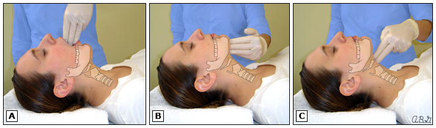

# Sedation in the ICU

## Topics Covered
- [x] Rapid sequence induction for emergency [intubation](Intubation.md)
- [x] Conscious sedation for procedures (lines, tubes, cardioversions, scopes)
- [x] Sedation for mechanical ventilation

## Rapid Sequence Induction (i.e. induction for [intubation](Intubation.md))
RSI is performed in patients at increased risk of gastric aspiration (read: ALL critically ill patients). The goal is to minimize time between onset of unconscious state and tracheal [intubation](Intubation.md).

### RSI Timeline
1. Preoxygenation
2. IV hypnotic (e.g. PPF)
3. IV rapid-onset [NMB](Neuromuscular%20Blockade.md) (e.g. succinylcholine or rocuronium)
4. Cricoid pressure (debated -- SRMA shows no measurable impact of this maneuvre)
5. *modified RSI: positive pressure mask ventilation (<20 cm H2O)*
6. Tracheal [intubation](Intubation.md) and confirmation
7. Proceed to [Sedation in the ICU > Sedation for mechanical ventilation](Sedation%20in%20the%20ICU#Sedation%20for%20mechanical%20ventilation)

### Medications in RSI
The goal is to have a non-titrated dose of rapid onset (45-60 seconds) IV medications to achieve both total unconsciousness and complete muscular relaxation.

1. IV induction agent (pick one)
	1. **Propofol**. The de-factor choice. Causes dose-dependent hypotension and bronchodilation. Few side effects otherwise (propoful infusion syndrome long-term). Dose is 1.5-3 mg/kg (e.g. 100-300 mg)
	2. **Midazolam**. Potent amnesic property. Causes dose-dependent myocardial depression. Frequently underdosed. Dose is 0.2-0.3 mg/kg (e.g. 10-20 mg)
	3. **Ketamine**. Stimulates catecholamine release, causes bronchodilation. Could be considered particularly for bronchospasm, septic shock, and hemodynamic compromise. Dose is 1-2 mg/kg.
	4. **Etomidate**. Excellent sedation with little hypotension. Suppresses adrenal cortisol production - be wary of this! Dose 0.3 mg/kg
2. IV opioid - consider **fentanyl** 3 mg/kg IV over 30-60 seconds as well to optimize the patient.
3. IV [NMB](Neuromuscular%20Blockade.md)
	1. **Rocuronium** 1.5 mg/kg (e.g. 100 mg). Time to [intubation](Intubation.md) level paralysis is 45-60 seconds with this dose, and effect last ~45 minutes. Multiple studies show it creates [intubation](Intubation.md) conditions very similar to succinylcholine.
	2. **Succinylcholine** 1.5 mg/kg (e.g. 100 mg). Time to [intubation](Intubation.md) level paralysis is 45-60 seconds with this dose, and effect last ~6 minutes.

## Procedural conscious sedation
The approach here will depend upon (1) baseline sedation status (awake, sedated?), (2) procedure invasiveness and pain ([chest tube](Thoracostomies.md)), line, wound debridement), (3) hemodynamic and respiratory status.

Importantly, the CAS practice guidelines state that *it is unacceptable for a single physician to administer an anesthetic, including deep procedural sedation, and simultaneously perform a diagnostic or therapeutic procedure*, except for procedures done with only infiltration of local anesthetic and/or minimal sedation.

### Equipment
- at the bedside
	- oxygen source and administration equipment
	- suction setup
	- basic airway equipment (ambu-bag, face mask, oral airways, SGA)
	- IV setup
	- Medications including reversal agents
	- monitoring (pulse oximetry, cardiac monitory, NIBP)
		- (waveform) capnography is recommended for moderate sedation and required for deep sedation
- easily available
	- advanced airway cart (laryngoscope and ETTs)
	- resuscitation card with defibrillator and resuscitation drugs

### Evaluation
- PMHx, Meds, Adverse Rxns and allergies
- fasting status and last meal. Per general CAS/ASA guidelines, moderate or deep sedation warrants fasting:
	- 8 hours post heavy/fatty meal
	- 6 hours post light meal (defined as toast or cereal with clear liquid) or full fluids
	- 2 hours post clear fluids
- [ASA](../Mechanical%20Ventilation/ASA%20Classification.md) classification, [OSA](../../Respirology/Sleep%20Medicine/Obstructive%20Sleep%20Apnea.md) risk
- Wt, baseline VS
- Physical examination including airway assessment
	- **LEMON mnemonic**: Look externally, Evaluate 3-3-2, Mallampati, Obstruction/[Obesity](../../Endocrinology/Obesity/Obesity.md), Neck mobility
	- **3-2-2 rule for difficult airway**.  The patient can open their mouth sufficiently to admit 3 of their own fingers, The distance between the mentum and the neck/mandible junction (near the hyoid bone) is equal to the width of 3 of the patient's fingers, The space between the superior notch of the thyroid cartilage and the neck/mandible junction, near the hyoid bone, is equal to the width of 2 of the patient's fingers.
- Risk of complications from sedation:
	- [ASA](../Mechanical%20Ventilation/ASA%20Classification.md) > 3
	- Morbid [obesity](../../Endocrinology/Obesity/Obesity.md), [OSA](../../Respirology/Sleep%20Medicine/Obstructive%20Sleep%20Apnea.md), pregnancy
	- severe neurologic impairment or CV/respiratory disease
	- known or suspected difficult [intubation](Intubation.md) or ventilation
	- invasive or prolonged procedure
	- high risk of aspiration (e.g. SBO, full stomach, GERD, DM/gastroparesis, hiatal hernia, GOO, esophageal pathology, increased IAP)

### Procedure
#### Adjunct Care
- *Routine administration of supplemental oxygen by nasal cannula or high-flow face mask is strongly recommended* for all patients undergoing procedural sedation and is required for deep sedation (CAS 2018)

#### Medications
- Should be provided in small boluses or by a titrated continuous infusion to achieve the minimum level of sedation required. Consider adjunct local or regional anesthesia in addition to sedation for particularly painful procedures.
- various combinations of medications can be used and should be short-acting and titratable, and be wary of medication synergism
	- IV sedative/dissociative/hypnotic +/- IV short-acting opioid
- No CAS recommendations are made as to the specific medications to be used. In general, consider and be knowledgeable about how to use and rescue from the following medication choices:
	- PPF
	- Midazolam
	- Fentanyl
	- Ketamine
	- PPF + Midazolam
	- PPF + ketamine
	- Midazolam + fentanyl (consider over PPF for longer procedures)

##### Propofol
- Acts within 40 seconds, lasts 6 minutes. Sedative/amnestic without analgesia.
- Loading dose is 0.5 to 1.5 mg/kg slow injection, with 0.25 to 0.5 mg/kg q1-3 minutes PRN. For example, 25-50 mg IV then 25 mg IV q1-3 minutes PRN. 
- Reduce dosing by 20-60% for older adults. The initial bolus should be maximum 0.5 mg/kg for these patients.

##### Midazolam
- Acts within 2-5 minutes, lasts 30-60 minutes. Anxiolytic/amnestic without analgesia.
- 0.02 to 0.03 mg/kg. In adults, this is generally 0.5-1.0 mg per dose and titrated to effect q2-5 minutes.

##### Fentanyl
- Acts within 2-3 minutes, and lasts 30 to 60 minutes. Pure analgesic without amnestic properties.
- When used in combination with a sedative for procedural sedation, dose is 0.5 mcg/kg (25-50 mcg) IV push boluses every 2 minutes until sedation/analgesia achieved.

##### Ketamine
- Rapid onset, lasts 10-20 minutes. Sedation, analgesia, and amnesia with preserved CV status and respiratory tone and ventilation status.
- Avoid in schizophrenia.
- Dose is 1-2 mg/kg over 1-2 minutes then 0.25 to 1 mg/kg q5-10 minutes. For example, 100 mg IV loading then 25-50 mg increments afterwards. In combination with other agents, use the lower end of these doses.
- Emergence reactions (distressing disorientation, dreamlike experiences, or hallucinations) can be prevented with MDZ (1-2 mg) or haloperidol (5 mg)
- Pretreatment with ondasetron 4 mg x 1 can be useful for prevention of N/V (4% ) associated with ketamine (occurs while awake)
- Can lead to laryngospasm (rare).

### Complications
1. Respiratory depression
2. CV depression
3. Aspiration
4. Nausea and vomiting - consider PONV evaluation and prophylaxis/treatment

## Sedation for mechanical ventilation
### PADIS 2018 Guideline Recommendations
- Target light levels of sedation (vs deep) in mechanically ventilated patients. No universal consensus definition of light sedation on the RASS exists, but generally in studies this corresponds to *RASS -2 to +1*
- use daily sedative interruption (DSI) protocols (target RASS -1 to +1) and nursing-protocolized targeted sedation to maintain light sedation.
- choice of sedatives
	- cardiac surgery patients - PPF preferred over benzodiazepine
	- mechanically ventilated medical/surgical patients - *PPF or DEX recommended over benzodiazepines* (shorter time to extubation, higher risk of self-extubation, higher rates of asymptomatic bradycardia with DEX)
		- Studies to know:
			- PPF vs BZD - no landmark trial.
			- DEX vs BZD - SEDCOM, MIDEX, MENDS
			- PPF vs DEX - PRODEX, MENDS2
		- current evidence suggests that for *light* sedation, DEX = PPF for most general ICU patients. Be wary of bradycardia. For deep sedation, DEX monotherapy is likely not enough based on pharmacology/anecdotal evidence (but not examined in RCTs)

### Current Evidence Base
#### MENDS (JAMA 2007)
- In mechanically ventilated patients, DEX improved coma-free days and time within goal sedation compared to LORAZ, but required more open-label fentanyl and had a higher incidence of bradycardia

#### [MENDS2 (NEJM 2021)](https://www.nejm.org/doi/10.1056/NEJMoa2024922)
- this multicentre (N=13) study randomized sedation for mechanically ventilated patients (N=422) with sepsis to either DEX or PPF based strategies with target RASS approx 0 to -2
- overall, there was no difference in number of days alive without delirium or coma at 14 days, ventilator-free days, death at 90 days, or cognitive status at 6 months
- safety end points were similar betweeen DEX and PPF
- **SUMMARY:** Among mechanically ventilated adults with sepsis who were being treated with recommended light-sedation approaches, outcomes in patients who received dexmedetomidine did not differ from outcomes in those who received propofol.

## References
1. Parrillo Critical Care Medicine
2. UpToDate (sections on RSII)
3. [PADIS Guidelines](../Best%20Practices/PADIS%20Guidelines.md)
4. Procedural sedation: a position paper of the Canadian Anesthesiologists’ Society (2018). https://www.cas.ca/CASAssets/Documents/Practice-Resources/Guidelines/12630_2019_1507_MOESM5_ESM_Appendix-6.pdf
5. Kingston Gen Hospital policy on adult procedural sedation: https://www.corhealthontario.ca/Adult-Procedural-Sedation-Policy.pdf
6. CADTH Sedative Agents During Medical Procedures Guidelines (2020): https://www.cadth.ca/sites/default/files/pdf/htis/2020/RB1462%20Procedural%20Sedation%20Guidelines%20Final.pdf
7. [Procedural sedation in adults outside of the operating room: General considerations, preparation, monitoring, and mitigating complications - UpToDate](https://www.uptodate.com/contents/procedural-sedation-in-adults-outside-of-the-operating-room-general-considerations-preparation-monitoring-and-mitigating-complications) & [Procedural sedation in adults outside of the operating room: Medication selection, dosing, and discharge criteria - UpToDate](https://www.uptodate.com/contents/procedural-sedation-in-adults-outside-of-the-operating-room-medication-selection-dosing-and-discharge-criteria?topicRef=264&source=see_link)