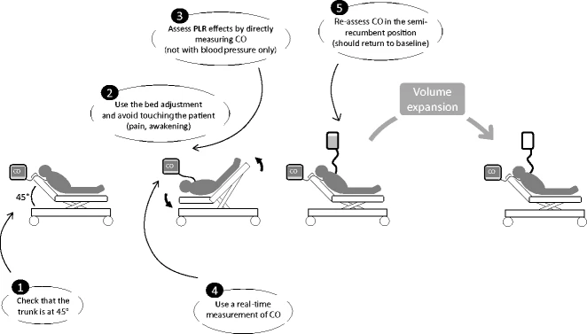

# Fluid Responsiveness
## Background
Aggressive volume expansion was the cornerstone of sepsis and resuscitation. **Aim of fluids is to increase venous return, improve SV, and therefore CO.** This works if the patient is on the ascending part of the Frank-Starling curve (see below).

Evidence shows that **fluid overload is detrimental,** increasing mechanical ventilation and mortality in sepsis, ARDS, abdominal compartment syndrome, AKI. How do we balance the benefits of volume expansion versus worsening lung and tissue edema?

> [!NOTE] Definition
> "Fluid responsiveness" is the improvement of cardiac output from a fluid challenge, commonly defined as 10-15% in SV after a small bolus. About 40-50% of ICU patients are fluid responsive.

## Static Markers (CVP, BP) are unhelpful
**CVP** was historically used for predicting fluid responsiveness. A given value of CVP does not predict fluid responsiveness, but **estimates volume status (LVEDV)**. A single CVP value can correspond to preload responsiveness or unresponsiveness, depending on the shape of the current Frank-Starling curve. Mean CVP is 8-12 in both responders and non-responders. CVP increases independently of volume responsiveness from PH, hypertrophic RV, high PEEP, high abdominal pressure, cardiac compression, TR, arrhythmia. The CVP instead is a good marker of preload and a key indicator of cardiac function, and one of the determinants for organ perfusion pressure (MAP - CVP).

The same arguments above apply to other static markers such as pulmonary artery occlusion pressure, global EDV with transpulmonary thermodilution, esophageal Doppler aortic flow time, IVC diameter, and LVEDV by echocardiography.

## Dynamic Assessment
These are surrogates of cardiac output before and after changes in preload. 2017 SRMA found that goal-directed therapy guided by dynamic fluid responsiveness assessment had RR of 0.59 for mortality with ARR 2.9%.

### Stroke Volume Variation (SVV) and Pulse Pressure Variation (PVV)
During positive pressure ventilation , insufflation decreases RV preload, decreasing LV preload. If LVSV changes in response to cyclic positive pressure variation, then both ventricles are preload dependent. This only really applies during mechanical ventilation.

- **PPV** was shown to predict the response of cardiac output to volume expansion by Michard et al. 2000. This is the marker of preload responsiveness that has the best evidence to date. Sensitivity 88% and specificity 89% with **median threshold 12%.**
- **SVV** is less easily measured; most research has occured in the OR with invasive arterial pulse pressure measurements.

**False Positives:** (1) spontaneous breathing (2) cardiac arrhythmias (3) increased intraabdominal pressures (4) right heart failure
**False Negatives:** (1) ARDS (due to low tidal volume ventilation and low compliance). In this case, can temporarily use a "tidal volume challenge" of VT= 8 ml/kg to assess if there is an increase of PPV > 3.5% or SVV > 2.5%; (2) open chest (low transmission of pressures); (3) very high respiratory rate.

### Vena Caval Dimension Variation-Distensibility
The changes in intrathoracic pressure induced by mechanical ventilation may induce some variations in the venae cavae in close proximity to the heart when the central blood volume is low. The variation of the inferior vena cava diameter measured by transthoracic echocardiography has been reported to detect preload responsiveness with reasonable accuracy. Lower accuracy in spontaneously breathing patients. Can be used in patients with cardiac arrhythmias.

-   **SVC diameter variation** or "collapsibility" has been shown to reflect fluid responsiveness but require TEE. Superior detection of preload responsiveness compared to IVC measurement.
-   **IVC diameter variation** has been found to have mixed evidence on whether it is a useful predictor of fluid responsiveness in the ER with spontaneously breathing patients. Only very high amplitude respiratory variation indicated fluid responsiveness.
	- [Intubated](../Procedures/Intubation.md) fully ventilated --> distensibility Index >15-20% likely fluid responsive
	- [Intubated](../Procedures/Intubation.md) breathing spontaneously --> not validated
	- Not [Intubated](../Procedures/Intubation.md) breathing spontaneously --> distensibility index >40% likely fluid responsive
-   **Right IJV** has been reported to predict fluid responsiveness, although even less accurate than IVC.

### Passive Leg Raise
This is essentially a **reversible "preload challenge" of 300 mL of blood** that can be repeated frequently without infusing any extracorporeal fluid. Accurate in spontaneously breathing patients, cardiac arrhythmias, low tidal volume ventilation, and low lung compliance.

In preload responders, the increased mean systemic pressure increases the venous return pressure gradient, increasing venous return, and cardiac output. In non-responders, the increased right atrial pressure balances the increased mean systemic pressure, so the pressure gradient of venous return and therefore cardiac output is unchanged.

Pooled sensitivity 85% and specificity 91% with a mean best threshold of 10% increased cardiac output.

> [!NOTE]
> Therefore, >10-15% pulse pressure increase after 60-90s passive leg raise indicates fluid responsiveness.

Technicalities: **needs direct CO measurement** as opposed to arterial pressure monitoring, continuous > intermittent measurement as the changes may only last < 1 minute. Methods to measure CO real-time are pulse contour analysis, esophageal Doppler aortic blood flow measurement, echocardiography with changes in the velocity time integral of the LVOT, peak velocity of carotid and femoral arteries. New technique is measuring ETCO2 (>5%) on stable mechanical ventilation.

## References
1.  Bednarczyk JM, Fridfinnson JA, Kumar A, et al. Incorporating Dynamic Assessment of Fluid Responsiveness Into Goal-Directed Therapy: A Systematic Review and Meta-Analysis. _Critical Care Medicine_. 2017;45(9):1538-1545. doi:[10.1097/CCM.0000000000002554](https://doi.org/10.1097/CCM.0000000000002554)
2.  Monnet X, Marik PE, Teboul JL. Prediction of fluid responsiveness: an update. _Annals of Intensive Care_. 2016;6(1):111. doi:[10.1186/s13613-016-0216-7](https://doi.org/10.1186/s13613-016-0216-7)
3.  Monnet X, Teboul JL. Passive leg raising: five rules, not a drop of fluid! _Critical Care_. 2015;19(1):18. doi:[10.1186/s13054-014-0708-5](https://doi.org/10.1186/s13054-014-0708-5)
4.  Abraham Markin. _Assessment of Fluid Responsiveness_.; 2019. Accessed December 16, 2021. [https://www.youtube.com/watch?v=XINQ7A4nh4k](https://www.youtube.com/watch?v=XINQ7A4nh4k)
5.  Drnandyala. Fluid responsiveness. Pocket ICU. Published December 12, 2018. Accessed December 16, 2021. [http://pocketicu.com/index.php/2018/12/11/fluid-responsiveness-and-functional-hemodynamic-monitoring/](http://pocketicu.com/index.php/2018/12/11/fluid-responsiveness-and-functional-hemodynamic-monitoring/)
6.  fluid responsiveness. thinking critical care. Accessed December 16, 2021. [https://thinkingcriticalcare.com/tag/fluid-responsiveness/](https://thinkingcriticalcare.com/tag/fluid-responsiveness/)