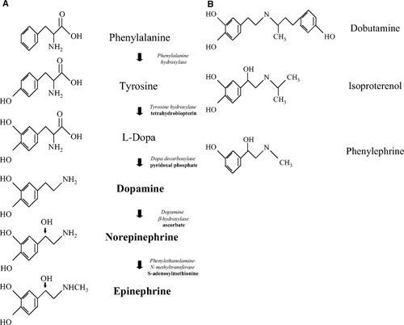

# Inotropes
## Background
### Indications
Intotropes are indicated for patients with LV systolic dysfunction, low CO, and low SBP (e.g. < 90 mmHg) resulting in end organ hypoperfusion (*i.e. cardiogenic shock*).
-   Short term hemodynamic support
-   Bridge therapy to MCS/ECLS/Transplant
-   Limited use in long-term hemodynamic support

### Caution
Inotropes can cause sinus tachycardia, increase RVR in AF (increased AVN conduction), induce myocardial ischemia and arrythmias, and increase mortality.

### Inotropic Agents
| Agent         | Class                     | MOA                                                                                                                                             | Dosing                | Notes                                                        |
| ------------- | ------------------------- | ----------------------------------------------------------------------------------------------------------------------------------------------- | --------------------- | ------------------------------------------------------------ |
| Dobutamine    | Beta agonist (synthetic)  | B1/B2 agonist. Variable A1 activity.                                                                                                            | 2-20 mcg/kg/min       |                                                              |
| Dopamine      | Beta agonist (endogenous) | Dose-dependent delta->beta->alpha affects. Introtropy, arteriovenous constriction.                                                              |                       |                                                              |
| Isoproterenol | Nonselective beta agonist | Beta 1/2 agonism.                                                                                                                               | 2-10 mcg/min          | Used for bradyarrhythmias (especially TdP), Brugade syndrome | 
| Milrinone     | PDE inhibitor             | PDE-3 inhibitor, decreases cAMP degradation distally to beta receptor. Increases Ca++ influx to cell. Vasodilation via vascular PDE inhibition. | 0.375–0.75 mcg/kg/min |                                                              |
| Levosimendan  | Ca-sensitizing agent      | Increases myocardial contraction with Ca++. PDE-3 inhibition.                                                                                   |                       |                                                              |

### Specific Use Cases
| Setting              | Guidance                                                                                              |
| -------------------- | ----------------------------------------------------------------------------------------------------- |
| Hypotension          | Dobutamine preferred over PDE-3 inhibitors or Ca-sensitizing agents due to less vasodilatory effects. |
| Renal insufficiency  | Dobutamine preferred to milrinone. Dose adjustment necessary with milrinone.                          |
| Recent beta-blockade | PDE-3 inhibitor preferred due to different MOA. Alternatively, use high-dose dobutamine.              |
| AFRVR               | Avoid dobutamine and dopamine if possible.                                                                                                      |

## Dobutamine
Dobutamine is a synthetic catecholamine that acts as a β1- and β2-receptor agonist.

- binds β1:β2 at a 3:1 ratio, therefore is a potent inotrope with weaker chronotropic effect
- vascular smooth muscle binding and β2 stimulation lead to mild vasodilation, particularly at lower doses (<5 mcg/kg/min). This effect is ameliorated at higher doses where vasoconstriction dominates
- **increases myocardial oxygen consumption significantly** despite its mild chronic effects at low-medium doses. "Exercise-mimicking effect" makes it also useful for diagnostic cardiac perfusion imaging. 
- **risk of malignant ventricular arrhythmias** can be observed at any dose
- rare risk of **hypersensitivity myocarditis** (eosinophilic) in 2-20% of patients. Dose-dependent risk.

## Milrinone
Milrinone is a phosphodiesterase 3 inhibitor that increases cardiac inotropy, lusitropy, and peripheral vasodilatation. Preference is often given to using milrinone in patients with severe pulmonary hypertension because of a purported mechanism of reducing pulmonary-artery pressures and improving right ventricular function.

- Causes hypotension - avoid a loading dose.
- Avoid in CAD given negative outcomes in OPTIME-HF trial.
- Most beneficial in nonischemic CM.
- Potentially negative mortality benefit compared to nitroglycerin/nesiritide.

## Isoproterenol
Isoproterenol is a potent, nonselective, synthetic β-adrenergic agonist with very low affinity for α-adrenergic receptors.

- powerful chronotropic and inotropic properties
- potent systemic and mild pulmonary vasodilatory effects
- stimulatory impact on stroke volume is counterbalanced by a β2-mediated drop in SVR, which results in a net neutral impact on CO.

## Dopamine
Dopamine, an endogenous central neurotransmitter, is the immediate precursor to [norepinephrine](Vasopressors.md) in the catecholamine synthetic pathway.

- **Pharmacokinetics:** Half-life 2-3 minutes, metabilized by MAO and COMT.
- **MOA:**
	1) D1/2 receptor agonism at lowest doses (0.5-2 mcg/kg/min) which causes vasodilation in coronary, renal, mesenteric, and cerebral beds. Also causes natriuresis via renal tubular action.
	2) Predominantly weak beta-1 agonism at low doses (2-10 mcg/kg/min) which promotes norepinephrine release.
	3) Increasing alpha1-mediated vasoconstriction as dose escalates (>10 mcg/kg/min). 
- **Dosing:**
	1) 1-5 mcg/kg/min IV (low dose)  "renal dosing"
	2) 5-15 mcg/kg/min IV (medium dose)  "inotrope"
	3) 20-50 mcg/kg/min IV (high dose) "vasopressor"
- **Caution:** arrhythmogenic at the highest doses. Increases myocardial oxygen demands. No evidence for any renoprotective effects.

## Levosimendan
Not routinely available in Canada or the USA.

## Evidence Base
### DOREMI (NEJM 2021)
[Milrinone as Compared with Dobutamine in the Treatment of Cardiogenic Shock | NEJM](https://www.nejm.org/doi/full/10.1056/NEJMoa2026845)

- **Question:** Is milrinone safer or more effective than dobutamine in the treatment of cardiogenic shock?
- **Design:** Single-centre blinded, 1:1 randomized and controlled, superiority trial
- **Population:** Consecutive adult patients admitted to the Ottawa CCU with cardiogenic shock (SCAI Stage B, C, D, E).
- **Intervention:** Milrinone (blinded)
- **Comparator:** Dobutamine (blinded)
- **Outcomes:** 
	- Primary: Composite of in-hospital mortality, resuscitated IHCA, cardiac transplant or MCS, nonfatal [MI](../../Cardiology/Ischemic%20Heart%20Disease/ACS.md), TIA/stroke, RRT
- **Results:**
	- N=192. Primary outcome: *49% vs 54%* (RR 0.90, P=0.47). No difference in subgroups, time-to-event analysis
	- Secondary outcomes: No differences in sub-primaries, CCU LOS, hospital LOS, NIV, invasive ventilation, AKI, biochemistry, arrhythmias, dose of other [Vasopressors](Vasopressors.md).
- **Takeaway:**
	- No significant advantage of milrinone over dobutamine. Trend towards slightly reduced primary outcome. No differences in safety profile
	- *Underpowered study with some bias, and cannot rule out milrinone being better. For now, use either one -- whichever you are more comfortable with.*

## References
1. [Inotropes and Vasopressors | Circulation](https://www.ahajournals.org/doi/full/10.1161/CIRCULATIONAHA.107.728840)
2. [Use of vasopressors and inotropes - UpToDate](https://www.uptodate.com/contents/use-of-vasopressors-and-inotropes)
3. [Current use of inotropes in circulatory shock | Annals of Intensive Care | Full Text](https://annalsofintensivecare.springeropen.com/articles/10.1186/s13613-021-00806-8)
4. [A pragmatic approach to the use of inotropes for the management of acute and advanced heart failure: An expert panel consensus - ScienceDirect](https://www.sciencedirect.com/science/article/pii/S0167527319325021)
5. [Inotropes in Acute Heart Failure: From Guidelines to Practical Use: Therapeutic Options and Clinical Practice | CFR Journal](https://www.cfrjournal.com/articles/inotropes-acute-heart-failure-guidelines-practical-use-therapeutic-options-and-clinical)
6. [Inotropic agents in heart failure with reduced ejection fraction - UpToDate](https://www.uptodate.com/contents/inotropic-agents-in-heart-failure-with-reduced-ejection-fraction)
7. [Comparative pharmacology of inotropes and vasopressors | Deranged Physiology](https://derangedphysiology.com/main/required-reading/pharmacology-and-toxicology/Chapter%201.3.2/comparative-pharmacology-inotropes-and-vasopressors)