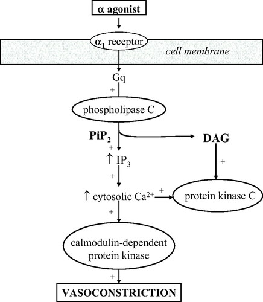

# Vasopressors
## Background
- The clinical efficacy of these agents has been investigated largely through examination of their impact on hemodynamic end points, and clinical practice has been driven in part by expert opinion, extrapolation from animal studies, and physician preference.
- Catecholamines mediate their cardiovascular actions predominantly through α1, β1, β2, and dopaminergic receptors, the density and proportion of which modulate the physiological responses of inotropes and pressors in individual tissues:
	- **β1-Adrenergic receptor** stimulation results in enhanced myocardial contractility through Ca2+-mediated facilitation of the actin-myosin complex binding with troponin C and enhanced chronicity through Ca2+ channel activation
	- **β2-Adrenergic receptor** stimulation on vascular smooth muscle cells through a different intracellular mechanism results in increased Ca2+ uptake by the sarcoplasmic reticulum and vasodilation
	- **α1-adrenergic receptor** stimulation on arterial vascular smooth muscle cells results in smooth muscle contraction and an increase in systemic vascular resistance
	- stimulation of **D1 and D2 dopaminergic receptors** in the kidney and splanchnic vasculature results in renal and mesenteric vasodilation through activation of complex second-messenger systems

## Comparison of Vasopressors
| Drug           | Indication                                                           | Dose Range                                                                    | α1    | β1   | β2  | DA  | Major Side Fx                                                                    |
| -------------- | -------------------------------------------------------------------- | ----------------------------------------------------------------------------- | ----- | ---- | --- | --- | -------------------------------------------------------------------------------- |
| Norepinephrine | Shock (vasogenic, cardiogenic)                                       | 0.01 to 3 mcg/kg/min                                                          | +++++ | +++  | ++  | N/A | Arrhythmias, bradycardia, peripheral ischemia, hypertension                      |
| Epinephrine    | Shock, cardiac arrest, anaphylaxis, bradycardia or heart block       | 0.01 to 0.1 mcg/kg/min                                                        | +++++ | ++++ | +++ | N/A | Ventricular arrhythmias, hypertension, cardiac ischemia, SCD                     |
| Phenylephrine  | Hypotension (vagal, medications), hypotensive aortic stenosis, LVOTO | Bolus: 100 to 500 mcg IV every 10-15 minutes. Infusion: 0.4 to 9.1 mcg/kg/min | +++++ | 0    | 0   | N/A | Reflex bradycardia, hypertension, severe vasoconstriction                        |
| Vasopressin    | Shock, cardiac arrest                                                | Infusion: 0.01 to 0.1 U/min (commonly 0.04 U/min). Bolus: 40U IV bolus.       | N/A   | N/A  | N/A | N/A | arrhythmias, hypertension, decreased cardiac output, splanchnic vasoconstriction | 

## Norepinephrine
NE is the major endogenous neurotransmitter liberated by postganglionic adrenergic nerves. NE is a potent alpha-1 adrenergic agonist with modest β-agonism:
- powerful vasoconstriction, and less potent direct inotropic effects
- primarily increases SBP, DBP, pulse pressure and has a minimal net impact on cardiac output
- minimal chronotropic effects
- **increases coronary blood flow** due to elevated DBP and local vasodilation around cardiomyocytes
- prolonged infusions can have a direct toxic effect on cardiac myocytes 

> [!NOTE] SOAP-II (NEJM 2010)
> This study compared **dopamine vs NE** in all forms of shock (septic, cardiogenic, and hypovolemic). No differences in mortality. NE was more effective as a vasopressor, and less associated with arrhythmias. Potential mortality benefit in cardiogenic shock compared to dopamine.

## Epinephrine
Epinephrine is an endogenous catecholamine with high affinity for β1/2 and alpha-1 receptors. 
- Low doses: primarily β effects. Higher doses: primarily alpha-1 effects
- **Increases coronary blood flow** through increased diastolic time ration at higher heart rates, and local coronary vasodilation
- **Increases arterial and venous pulmonary pressures** through pulmonary vasoconstriction and increased pulmonary blood flow
- Prolonged infusions can have a direct toxic effect on cardiac myocytes 

## Phenylephrine
Phenylephrine is an almost purely alpha adrenergic agent, primarily used as a rapid bolus for immediate correction of sudden severe hypotension.
- useful in severe hypotension and aortic stenosis, medication mediated hypotension (e.g. sildenafil + nitrates), to decrease the outflow tract gradient in LVOTO, and to correct the vagally mediated hypotension during percutaneous diagnostic or therpeutic procedures (e.g. [central line](../Procedures/Central%20Lines.md) insertions)
- virtually NO direct heart rate effects, but can cause baroreceptor-mediated reflex HR responses after rapid alterations in MAP

## Vasopressin
Endogenously, vasopressin is stored in the posterior pituitary gland and released in response to increased plasma osmolality or hypotension, pain, nausea, hypoxia. Its circulatory effects are through V1 (vascular smooth muscle constriction) and V2 receptors (renal collecting duct permeability).

#### Cardiovascular effects of vasopressin
- Direct V1-mediated global vasoconstriction which is **preserved with hypoxia and acidosis**, unlike most catecholaminergic vasopressors. Effects are synergistic with catecholaminergic vasopressors (increases sensitivity).
	- at higher doses, coronary artery vasoconstriction may cause myocardial ischemic (>3 units per hour)
	- probably causes some degree of cerebrovascular vasoconstriction (unknown clinical significance)
- neutral/inhibitory effect on cardiac output
- Reflex bradycardia
- Neutral to slightly decreasing effect on pulmonary hypertension
- *minimal vasoconstrictor effects in physiologically normal patients with preserved autonomic responses*
- 

#### Vasopressin dose matters
- at low doses, vasopressin acts primarily as ADH to increase free water urinary reabsorption. There is a maximal effect for this response.
- at higher doses, vasopressin continues to have an almost-pure V1 vasoconstriction role. Endogenously, vasopressin levels increase exponentially with hypotension, but in prolonged shock states this endogneous effect loses potency. This is *likely due to pituitary vasopressin depletion.*
- generally consider a 2.4 U/hr infusion rate +/- 4 U bolus
- 

#### Indications and evidence base for vasopressin
| Indication            | Evidence Base                                                                                                                    |
| --------------------- | -------------------------------------------------------------------------------------------------------------------------------- |
| Septic shock (+/- NE) | VASST, VANISH, VANCS II                                                                                                                   |
| Cardiogenic shock     | No RCTs. Remember it is reasonably neutral with cardiac output, pulmonary vascular resistance, and coronary vascular resistance. |
| LVOTO                 | Theoretical. Due to avoidance of beta1 agonism.                                                                                  |
| Vasoplegic shock      | Post-cardiac surgery (VANCS). With milrinone, vasopressin possibly better than NE.                                                                  |
|                       |                                                                                                                                  |
Know the **VASST, VANISH, VANCS trials**. Overall, vasopressin has no difference in mortality (except for perhaps a septic shock subset), but should be used early to reduce the amount of catecholaminergic vasopressors used. Most likely reduces the incidence of atrial fibrillation, especially in post-cardiac surgery vasoplegia.
- **VANCS II** - vasopressin vs NE in cancer patients with septic shock. Equivalent.

#### Contraindications to vasopressin
1. Water intoxication/hyponatremia
2. Coronary artery disease (possibly)
3. Cerebral vessel vasospasm (established)
4. Late pregnancy (premature uterine contractions -- oxytocin-like effect)

# References
1. [Vasopressin | Deranged Physiology](https://derangedphysiology.com/main/cicm-primary-exam/required-reading/cardiovascular-system/Chapter%20978/vasopressin)