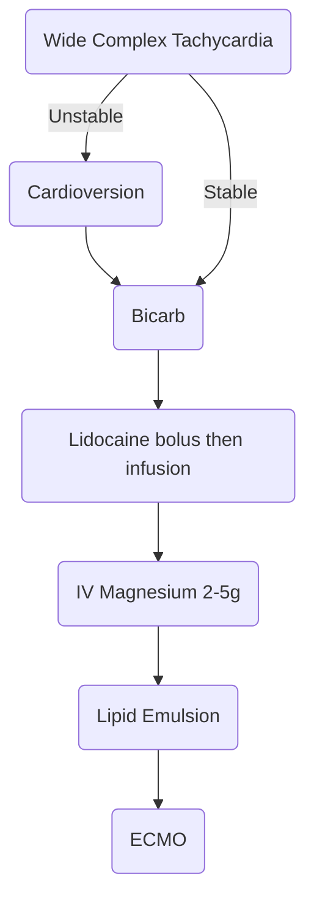

---
aliases:
  - lipid emulsion
  - intralipid
  - TCA toxicity
---
“Sodium channel blocker” is used here _solely_ to refer to agents with either class Ia or class Ic antiarrhythmic activity, which causes a slowing of phase-zero depolarization in cardiomyocytes (purple arrows above). 

# Pathophysiology
Slowing phase-zero depolarization on a cellular level causes QRS prolongation, leading to characteristic EKG changes described further below.

TCAs have several physiologic effects. Tricyclics mediate their cardiotoxic effects via blockade of myocardial fast sodium channels (QRS prolongation, tall R wave in aVR), inhibition of potassium channels (QTc prolongation) and direct myocardial depression. Other toxic effects are produced by blockade at muscarinic (M1), histamine (H1) and α1-adenergic receptors.

- Sodium channel blockade (generally the most important and acute issue)
- Anticholinergic activity, potentially causing an anticholinergic toxidrome.
- Blockade of peripheral alpha-1 adrenergic receptors, causing vasodilation.
- Central antihistamine activity, causing somnolence.
- Antagonism of central GABA-A receptors, promoting seizure.
- Inhibition of presynaptic reuptake of dopamine, norepinephrine, and serotonin.

# Sodium-Channel Blocking Drugs
- TCAs: amitriptyline, clomipramine, desipramine, imipramine, nortriptyline, protriptyline, trimipramine.
- Antidepressants: bupropion, citalopram, fluoxetine, maprotiline, paroxetine, venlafaxine.
- Type IA antiarrhythmics: disopyramide, procainamide, quinidine
- Type IC antiarrhythmics: flecainide, propafenone
- Beta-blockers: acebutolol, betaxolol, oxprenolol, propranolol.
- Antipsychotics: thioridazine, loxapine.
- Antihistamines: chlorpheniramine, diphenhydramine, dimenhydrinate, doxepin.
- Antiepileptics: carbamazepine, oxcarbazepine, lacosamide, lamotrigine, phenytoin.
- Antimalarials: chloroquine, hydroxychloroquine, quinine.
- Muscle relaxants: orphenadrine, cyclobenzaprine.
- Miscellaneous: Amantadine, cocaine, tramadol, topiramate, some insecticides.

# Clinical Manifestations
## ECG Changes
ECG changes are the only test that can suggest/confirm sodium channel blockade in an altered patient with minimal history.

If ECG changes are suspected to be secondary to sodium channel blockade toxicity, **give 100 mEq hypertonic bicarb** and repeat the ECG afterwards. Interval improvement therefore suggests the diagnosis.

**Terminal right axis deviation with tall R in aVR** is the classic ECG finding. This is caused by slow conduction through the myocardium, with delayed RV depolarization: deep terminal S wave in lead I, and terminal tall R wave in aVR.

**QRS widening** is not specific for this toxidrome but can quantify the severity of the intoxication. QRS > 100 suggests elevated seizure risk (26%); QRS > 160 suggests elevated risk of VT (50%). A sine wave pattern can emerge, which can mimic VT.

**QT prolongation** can occur due to inhibition of K channels.

**Type I Brugada sign** can develop as well.

## Cardiovascular Effects
Hypotension, sinus tachycardia, monomorphic VT, ECG changes as above.

## CNS Effects
Delirium, agitation, sedation, coma, and seizures.

### Anticholinergic Toxidrome
Can be present in many drugs that inhibit sodium channels, such as TCAs and antihistamines. Flushed dry skin, hyperthermia, pupillary dilatation, delirium, coma, urinary retention, constipation.

# Treatment of Sodium Channel Blockade and TCA Toxicity
Overdose **>10mg/kg** with signs of **cardiotoxicity** (ECG changes) requires resuscitative management.

## Best Supportive Care
### [Intubation](../Procedures/Intubation.md) if required
Consider [intubation](../Procedures/Intubation.md) with worsening mental status, seizures, or hypoventilation with respiratory acidosis. Pre-[intubation](../Procedures/Intubation.md), consider bicarbonate therapies and hemodynamic supports to minimize risk of cardiovascular collapse.

Consider apneic ventilation with NIV.

Once [intubated](../Procedures/Intubation.md), target mild hyperventilation (etCO2 ~20) then check a blood gas. Sedate with antiepileptic agent: propofol, benzo, ketamine.

### Drug Exposure/Decontamination
- A dose of activated charcoal may be considered (e.g., 1 gram/kg up to 50 grams). Agents with anticholinergic activity (e.g., TCAs) may slow intestinal motility, allowing charcoal to be effective even when given more than one hour after ingestion.
- Increased elimination: none
- Antidote: none

### Hypotension/Shock
Early pressors. Consider vasopressin as effects are not mediated by alpha adrenergic activity (blocked in TCA toxicity).

Consider both bicarbonate and lidocaine as below.

### Seizures
These are extremely dangerous (for obvious reasons). Respiratory acidosis leads to increased drug levels which leads to worsened toxicity. Seizures need to be aggressively treated.

- Immediate therapies: Benzodiazepines and hypertonic bicarbonate.
- Intubate if required. Sedate with PPF or benzodiazepines.
- Ongoing AEDs can be considered for recurrent seizures or status epilepticus: LEV is the AED of choice. Avoid PHT as it can exacerbate cardiac toxicity.

### Wide Complex Tachycardia
Often represents ST with wide bizarre QRS due to delayed conduction rather than true VT.

## Bicarbonate Therapy
How does bicarb work? High sodium content increases the function of cardiac Na channels, increasing the pH may decreasing drug binding to the Na channel, and increasing the pH reduces the free drug concentration of drugs such as TCAs and flecainide.

**Indications for bicarbonate:** seizure, ventricular arrhythmia, QRS > 100 (new from baseline), hypotension without hypovolemia.

**Initial loading dose:** 100 mEq NaHCO3 repeated PRN to decrease the QRS interval to <100 ms. Occasionally can require many ampules (e.g. 10-30x) but generally will respond to a few ampules alone.

**Maintenance therapy:** continue maintenance isotonic NaHCO3 at 150-250 mL/hr. Continue to monitor the QRS, electrolytes.

**Therapeutic goals:**

1. QRS < 100 ms (if possible)
2. pH moderately elevated (7.50-7.55) with bicarbonate or hyperventilation
3. Avoid excess hypernatremia
4. Avoid hypokalemia and hypocalcemia

## Lidocaine
- **MOA:** Class IB antiarrhythmic which inhibits Na channels, but does so in a competitive inhibition manner. As well, does not prolong the QRS and can shorten the QTc.
- **Definite indications:** recurrent ventricular arrhythmia despite bicarb. Persistent cardiac arrest due to VT/VF.
- **Possible indications:** persistent hypotension with prolonged QRS refractory to other interventions, very wide QRS despite bicarb.
- Dosing:
	- **Bolus dose:** 1.5 mg/kg over 2-3 minutes
	- **Infusion dose:** 1-2 mg/min or as required
	- **Additional doses:** 0.5-0.75 mg/kg every 5-10 minutes up to maximum cumulative dose of 3 mg/kg for refractory VT/VF.

## Lipid Emulsion
- Third-line therapy. Indications can be refractory shock, cardiac arrest, recurrent arrhythmias despite other therapies. Effective for [Local Anaesthetic Systemic Toxicity (LAST)](Local%20Anaesthetic%20Systemic%20Toxicity%20(LAST).md), TCA toxicity, other sodium channel blocker toxicity.
- MOA: unclear. The **lipid shuttle theory** postulates that ILE acts as a scavenger of lipophilic toxins which remove the drug from sensitive organs and high perfusion organs, and redirects to other organs like the muscle and liver for detoxification and storage. 
- Adverse effects: lab errors, pancreatitis, ARDS, ARF
- contraindications: severe allergies to soybean oil and egg yolk; lipid storage and lipid metabolism disorders

Dosing per **[ACMT Guidance](https://www.acmt.net/wp-content/uploads/2022/06/PRS_111001_Interim-Guidance-for-the-Use-of-Lipid-Resuscitation-Therapy.pdf)**:

| Phase              | Dose                                                                              |
| ------------------ | --------------------------------------------------------------------------------- |
| Bolus              | 20% lipid emulsion 1.5 mL/kg over 2-3 minutes                                     |
| Infusion           | 20% lipid emulsion 0.25 mL/kg/min                                                 |
| Repeat bolus       | As required for patients with asystole, PEA, or recurrent hemodynamic instability |
| Maximum total dose | 10-12 mL/kg regardless of patient response                                                                                  |

LRT should be terminated after 1 hour or if the patient's clinical status permits, sooner. Longer infusions may be required in severe cases.