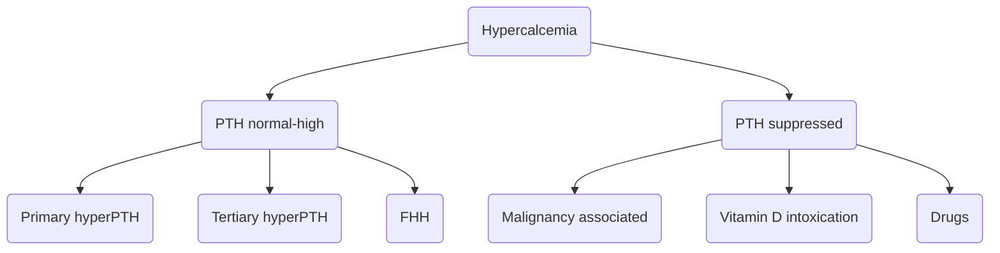

# Hypercalcemia

> [!info] 
> More than 90% of hypercalcemia is due to primary hyperparathyroidism and cancer.

## PTH-mediated \(low or normal\)

* *primary hyperPTH*
  * elevated urine calcium-creatinine clearance \(physiologic response\)
* *tertiary hyperPTH*
  * due to CKD which leads to phosphate retention which leads to +PTH activity as compensation
* *familial hypocalciuric hypercalcemia \(FHH\)*
  * genetic mutation in CaSR that leads to altered set point in PTH \(too high for the given serum calcium level\)
  * autosomal dominant

## PTH-independent \(low\)
* *Malignancy associated*
  * Humoral hypercalcemia of malignancy \(HMM\)
    * PTHrP-related
    * not PTHrP-related
  * osteolytic lesions
* *Vitamin D intoxication*
  * overingestion
  * Williams syndrome \(+endogenous production, genetic\)
  * Granulomatous disease \(+activation\)
    * sarcoidosis
    * HIV
    * TB
    * Histoplasmosis & coccidiomycosis
    * Leprosy
* *Drugs*
  * Vitamin A
  * Thiazides
  * Lithium
  * TPN
  * Hormone therapy
  * Milk-alkali syndrome
  * Aluminum intoxication \(in CKD\)
  * Aminophylline
* *Thyrotoxicosis* \(increases bone turnover. May respond to beta-blockers\)
* *[Adrenal insufficiency](../HPA%20Axis%20Disorders/Adrenal%20Insufficiency.md)*
* VIPoma
* *Immobilization* \(do not forget!\)

## Management

> [!NOTE] Info
> Depends on severity and symptoms of hypercalcemia. Treat the underlying cause as well. Hold thiazides \(hyper-GLUC syndrome\) and vitamin D, and consider restricting dietary calcium. **Consider excluding lymphoma prior to steroids.**

**Hydration and diuresis - flush the body out.**

* IV fluids \(bolus then high rate infusion\), manage the electrolytes. Patients tend to be extremely dehydrated due to symptoms of hypercalcemia. Saline enhances urinary calcium excretion by reducing the distal tubular reabsorption of calcium and sodium.
* Loop diuretics only for those with volume overload from resuscitation.  Watch the lytes.

**Anti-calcium drugs** if hydration and saline diuresis is not enough.
* Calcitonin
  * limited evidence, may suffer from tachyphylaxis. Consider as adjunct.
* Bisphosphonates
  * first-line for malignancy-related hypercalcemia, as they inhibit osteoclastic bone resorption.
  * takes 2-4 days to work, so start right away
  * Pamidronate or zoledronic acid IV
  * *contraindicated in primary or tertiary hyperPTH*
  * Infusion can cause a fever, and both drugs can cause nephrotic range proteinuria
* Denosumab \(Prolia\)
  * RANKL inhibitor
  * effective for malignancy-associated hypercalcemia refractory to bisphosphonates
* Glucocorticoids
  * if the hypercalcemia is mediated by calcitriol production
    * granulomatous disease
    * lymphoma
    * myeloma
  * blocks the alpha-1 hydroxylase conversion of 1\(OH\)vitD to 1,25\(OH\)vitD

**Hemodialysis** is the last-line option for refractory hypercalcemia or renal failure.

