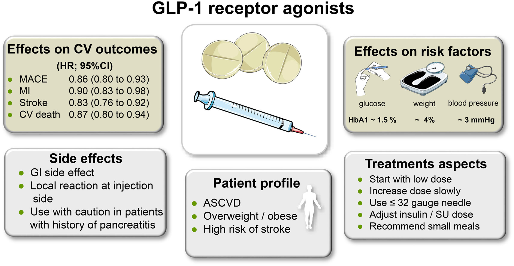

---
aliases:
  - GLP1
  - GLP-1 RA
  - GLP1 RA
  - Semaglutide
  - Liraglutide
---
# GLP-1 Receptor Agonists

GLP1 agonists are diabetes medications with growing applications in cardiovascular disease, bariatric medicine. GLP-1 RA were initially developed as glucose-lowering drugs because activation of the GLP-1 receptor by these agents leads to a reduction in blood glucose and an improvement in postprandial glucose metabolism. By stimulating GLP-1R in hypothalamic neurons, GLP-1 RA additionally induce satiety and lead to weight loss.

# CV Outcomes of GLP-1 RA
| Drug          | Trial (Year)     |
| ------------- | ---------------- |
| Lixisenatide  | ELIXA            |
| Liraglutide   | LEADER           |
| Semaglutide   | SUSTAIN 6        |
| Exenatide     | EXSCEL           |
| Albiglutide   | HARMONY OUTCOMES |
| Dulaglutide   | REWIND           |
| Semaglutide   | PIONEER-6        |
| Efpeglenatide | AMPLITUDE-O      |

A meta-analysis of these 8 CVOTs revealed a 14% reduction in the primary outcome of the 3-component MACE (cardiovascular death, nonfatal MI, and nonfatal stroke; number needed to treat, 65), with moderate heterogeneity. These results improve to a 15% reduction in MACE with low heterogeneity (14.9%) after removal of the ELIXA trial.

|                                  | Main analysis with all 8 CVOTs (HR; I2) | Sensitivity analyses minus ELIXA (HR; I2) |
|:-------------------------------- |:--------------------------------------- |:----------------------------------------- |
| MACE                             | 0.86 (0.80 to 0.93) 45%                 | 0.85 (0.80 to 0.90) 15%                   |
| CV death                         | 0.87 (0.80 to 0.94) 13%                 | 0.85 (0.78 to 0.93) 12%                   |
| MI                               | 0.90 (0.83 to 0.98) 27%                 | 0.88 (0.81 to 0.96) 16%                   |
| All-cause mortality              | 0.88 (0.82 to 0.94) 10%                 | 0.87 (0.81 to 0.94) 17%                   |
| Incident HHF                     | 0.89 (0.82 to 0.98) 3%                  | 0.88 (0.79 to 0.98) 12%                   |
| Kidney composite (+ albuminuria) | 0.79 (0.73 to 0.87) 48%                 | 0.78 (0.71 to 0.87) 57%                   |
| Worsening kidney function (eGFR) | 0.86 (0.72 to 1.02) 43%                 | 0.82 (0.69 to 0.98) 40%                   |

> [!NOTE]
> GLP-1 RA mainly reduce ASCVD-associated outcomes such as MI, stroke, and cardiovascular death.
# Kidney Outcomes of GLP-1 RA

# Obesity Outcomes of GLP-1 RA

# Guideline Recommendations for GLP-1 RA
1. The 2019 European Society of Cardiology guidelines on diabetes, prediabetes, and CVD recommend treatment with GLP-1 RA (or SGLT2i) in patients with T2D and atherosclerotic cardiovascular disease (ASCVD) or high/very high risk (high-risk patients, diabetes duration ≥10 years without target organ damage plus any other additional risk factor; very high–risk patients, diabetes and established CVD, evidence of target organ damage [proteinuria, eGFR <30 mL/min/1.73 m2, left ventricular hypertrophy, or retinopathy], 3 or more major risk factors, or early-onset type 1 diabetes [of long duration [>20 years]) to reduce cardiovascular events.]
2. 2020 report of the American College of Cardiology Solution Set Oversight Committee on novel therapies for cardiovascular risk reduction in patients with T2D recommends initiating a patient-clinician discussion about the use of an SGLT2i and/or a GLP-1 RA with demonstrated cardiovascular benefit for patients with T2D who have or who are at very high risk for clinical atherosclerotic cardiovascular disease, HF, and/or diabetic kidney disease
3. 2022 American Diabetes Association “Standards of Medical Care in Diabetes” recommend treatment with GLP-1 RA or SGLT2i in T2D with ASCVD or high risk (such as patients ≥55 years of age with coronary, carotid, or lower-extremity artery stenosis >50% or left ventricular hypertrophy), independently of baseline HbA1c, individualized HbA1c target, or metformin use
# References
1. [GLP-1 Receptor Agonists for the Reduction of Atherosclerotic Cardiovascular Risk in Patients With Type 2 Diabetes | Circulation](https://www-ahajournals-org.libaccess.lib.mcmaster.ca/doi/full/10.1161/CIRCULATIONAHA.122.059595#d1e1515)
2. 