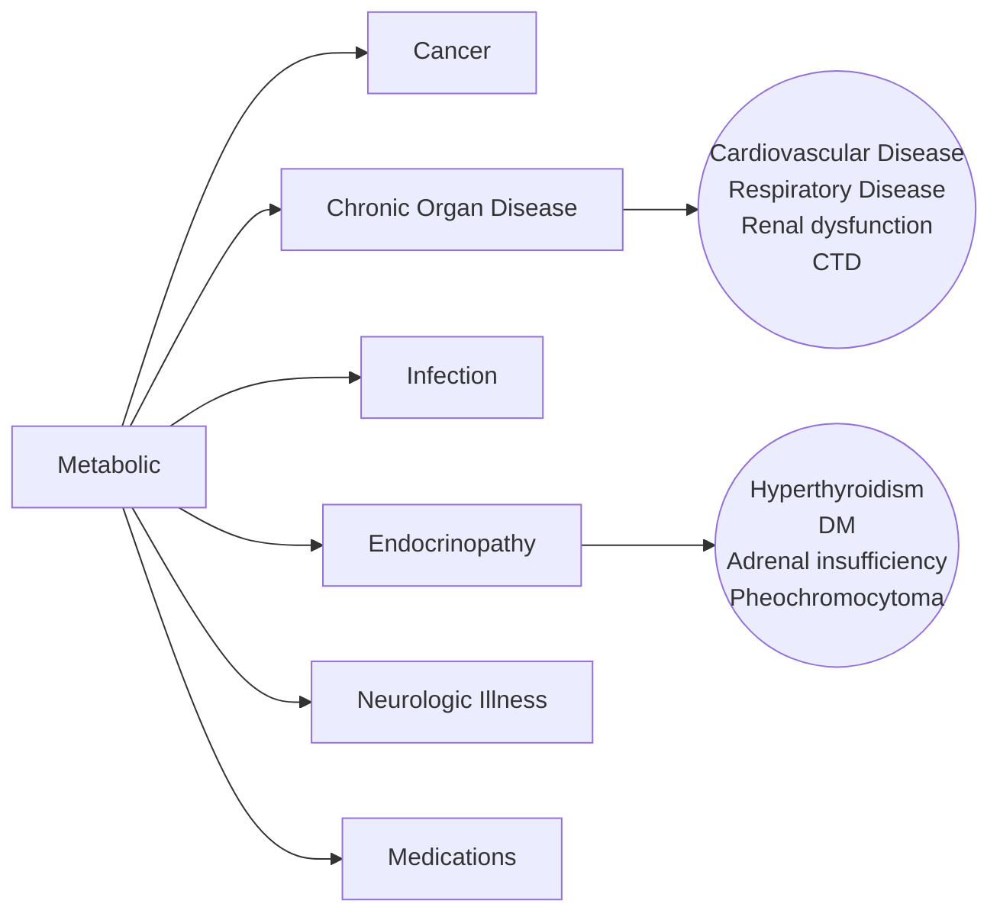
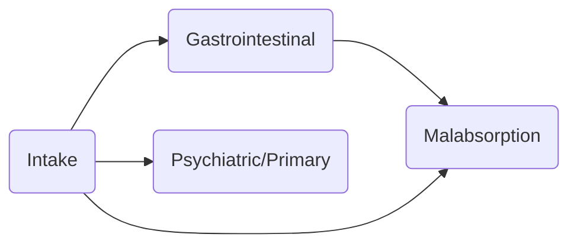

```mermaid
graph LR

A[Metabolic] --> B[Cancer] & C[Chronic Organ Disease] & D[Infection] & E[Endocrinopathy] & F[Neurologic Illness] & G[Medications]

C --> H((Cardiovascular Disease <br>Respiratory Disease<br>Renal dysfunction<br>CTD))
E --> I((Hyperthyroidism<br>DM<br>Adrenal insufficiency<br>Pheochromocytoma))

```

```mermaid
graph LR
B(Intake)
D(Gastrointestinal) --> 
E(Malabsorption)
F(Psychiatric/Primary)
B --> D & E & F
```

