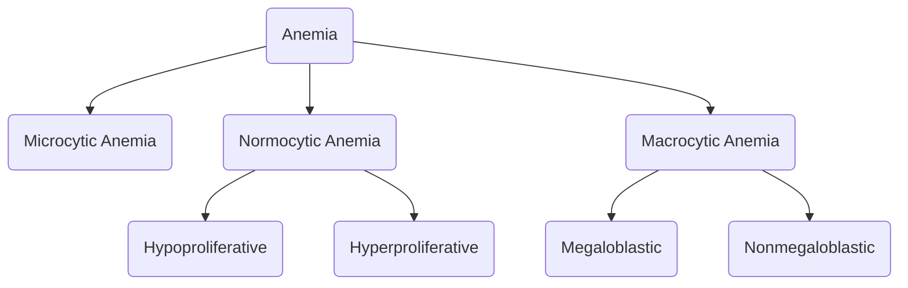

# Microcytic Anemias
1. [Iron deficiency anemia](Iron%20deficiency%20anemia.md)
2. Thalassemia
3. Sideroblastic anemia
4. Lead poisoning

# Normocytic Anemias
## Hypoproliferative Anemias
1. Early [[Iron deficiency anemia]]
2. Anemic of chronic disease
3. Sideroblastic anemia
4. Hypothyroidism
5. Chronic kidney disease
6. Bone marrow failure

## Hyperproliferative Anemias
1. [Hemolytic Anemia](Hemolytic%20Anemia.md)
2. Hemorrhage
3. Hypersplenism

# Macrocytic Anemias
## Megaloblastic Anemia
1. Vitamin B12 deficiency (elevated MMA and homocysteine)
2. Folate deficiency (elevated homocysteine)
3. Copper deficiency
4. Drugs and toxins (nitrous oxide, alcohol, azathioprine, mycophenolate, methotrexate, hydroxyurea, tetracyclines, penicillins, trimethoprim, phenytoin, allopurinol, colchicine, metformin, PPI)

## Nonmegaloblastic Anemias
1. Alcohol (MCV generally <110 fL)
2. Chronic liver disease
3. Myelodysplasia or [Myelodysplastic syndrome](../Malignant%20Hematology/Myelodysplastic%20syndrome.md)
4. Reticulocytosis (generally >10% and in the context of hemolysis)
5. Pregnancy
6. Hypothyroidism
7. Aplastic anemia
8. Pure red cell aplasia
9. Acute leukemia
10. Multiple myeloma