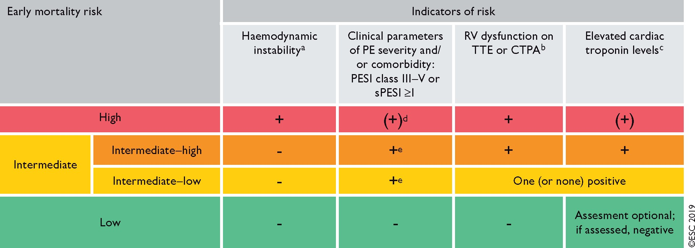

# Pulmonary Embolism
# Evaluation
## Risk Stratification
Per the ESC 2019 Guidelines, patients are separated into **High, Intermediate-High, Intermediate-Low, or Low risk** for early mortality.

### High-Risk, or Massive PE
- These patients present with hemodynamic instability, evidence of RV dysfunction, and possibly elevated cardiac enzymes.
- Hemodynamic instability is defined as:
	1. Hypotension (SBP < 90 mmHg for 15 minutes, fall in SBP >40 mmHg from baseline for 15 minutes), vasopressor requirement, or cardiac arrest
	1. Exclusion of sepsis, hypovolemic, new arrhythmia

### Intermediate Risk, or Submassive PE
- These patients have evidence of RV dysfunction, may have elevated cardiac enzymes, or an elevated PESI risk (class III-IV or sPESI >= 1)

### Low-Risk
- No hemodynamic compromise, normal cardiac enzymes (if tested), and no evidence of RV dysfunction
- low PESI risk class (I or II), sPESI = 0

## RV Assessment
Either with echocardiography or CT angiography.

# Resuscitation of PE
1. Volume management
2. Early vasopressors (NE) +/- inotropes (dobutamine)
3. Consider thrombolysis
4. Avoid [intubation](../Critical%20Care/Procedures/Intubation.md)
5. Consider ECMO for refractory cases

# Treatment Strategy
## Massive PE
- Strongly consider **thrombolysis with tPA** (make sure to review absolute and relative contraindications to thrombolysis).
- If there are absolute contraindications to lytics, then consider **IR clot removal or surgical embolectomy**.

## Submassive/Intermediate Risk PE
### Intermediate-High
- If there are no absolute contraindications to lysis, then consider smaller dose of tPA (0.5 mg/kg up to maximum 50 mg) over 2 hours
- If there are relative contraindications consider 25 mg tPA as a slow infusion
- If there are absolute contraindications then anticoagulation alone is preferred.

### Intermediate-Low
Anticoagulation alone.

## Low-Risk PE
Anticoagulation alone.

## Subsegmental PE
- Contentious area. A 2021 [study](https://www.acpjournals.org/doi/10.7326/M21-2981) found that the risk of 90-day recurrent VTE in non-anticoagulated patients with isolated single SSPE was ~2%, and those with multiple is about ~5.7%. Interesting, the 90-day risk of recurrent VTE in patients treated with anticoagulation is approx 3% based on prior studies. Therefore, there might not be a clinically significant risk reduction with full anticoagulation for patients with a single SSPE.
- The 2021 CHEST guidelines recommend **surveillence** over anticoagulation for those with low risk of recurrent VTE, and **anticoagulation** over surveillance for those at high risk of recurrent VTE. This only applies if proximal DVT is ruled out (with ultrasonography)

> [!NOTE] What is the takeaway? 
> As of 2022, if the patient has a single SSPE and no particular risk factors for recurrence or decompensation (active cancer, cardiopulmonary poor dysfunction, completely unprovoked), and bilateral compression US is negative for DVT, then *it is reasonable to consider no anticoagulation* and close monitoring instead (with perhaps repeat ultrasounds in 2-3 weeks).

# Thrombolysis
- Hold anticoagulation (IV heparin) before and during the infusion. Fully anticoagulate patients with IV UFH afterwards (resume without bolus when aPTT <2x ULN). Then, transition to oral agent once stable for 24-48 hours.
- a consistent finding among studies is that thrombolytic therapy leads to early hemodynamic improvement and, although a mortality benefit may exist, it occurs at a cost of increased major bleeding. Per the ESC 2019 guidelines: Thrombolytic therapy leads to faster improvements in pulmonary obstruction, PAP, and PVR in patients with PE, compared with UFH alone; these improvements are accompanied by a reduction in RV dilation on echocardiography.
- 10% risk of severe bleeding, 1.7% risk of [intracranial hemorrhage](../Critical%20Care/Neuro%20Critical%20Care/Intracranial%20Hemorrhage.md) (SRMA)

## Massive PE
- FDA approved regimen: IV tPA (alteplase) 100 mg over 2 hours.
- Consider in more urgent situations (none are shown to be superior)
	- infusion over 15 minutes
	- 20 mg IV bolus then 80 mg IV over 2 hours

## Intermediate Risk PE
While not routinely considered, thrombolysis can be considered for patients on anticoagulation who are decompensating or have higher risk of early mortality, anticoagulation treatment.

Some studies (particularly **PEITHO**) have examined thrombolysis in submassive PE and generally find no balanced benefit from thrombolysis (perhaps improved hemodynamic or pulmonary hypertension status, against increased bleeding risk). The **MOPETT** study used a particular regimen of tPA 0.5 mg/kg (up to a max of 50 mg) given as a 10 mg bolus followed by the remainder over 2 hours (i.e. reduced dose) for a particular definition of submassive PE ("moderate", with few patients having RV dysfunction); it showed that the risk of pulmonary hypertension was reduced compared to anticoagulation alone.

> [!INFO] PEITHO (NEJM 2014)
> Among patients with submassive PE being treated with unfractionated heparin, administration of tenecteplase (30-50 mg IV once over 5-10 seconds) reduces a composite endpoint of all-cause mortality or hemodynamic decompensation at 7 days when compared to placebo, though this was driven by reduced hemodynamic decompensation. Tenecteplase was associated with increased rates of major extracranial bleeding at 7 days (6.3% vs. 1.2%; P<0.001; NNH 20) and strokes at 7 days (2.4% vs. 0.2%; P=0.004; NNH 45).

## Cardiac Arrest
- Give a 50 mg IV tPA *bolus* over 2 minutes, consider also starting a vasopressor early  if in PEA arrest (obtain aterial access, use POCUS ECHO!). Follow with another 50 mg IV bolus after 15 minutes in the absence of ROSC.
- once a thrombolytic drug is administered, cardiopulmonary resuscitation should be continued for at least 60–90 min before terminating resuscitation attempts (ESC 2019)

# Anticoagulation
- Massive/high risk PE --> IV UFH with bolus dose
- Intermediate or low-risk PE --> LMWH or fondaparinux or OAC (DOAC or VKA with bridging)

# Special Populations
- Malignancy: [Cancer Associated Thrombosis](Cancer%20Associated%20Thrombosis.md)
- Pregnancy:
- Renal failure: IV UFH, VKA
- Prohibitive bleeding risk which is a contraindication to anticoagulation (active bleeding, surgery, etc).
	- Further exclude DVT
	- Consider IVC filter

# References
1. [2019 ESC Guidelines for the diagnosis and management of acute pulmonary embolism developed in collaboration with the European Respiratory Society (ERS) | European Heart Journal | Oxford Academic](https://academic.oup.com/eurheartj/article/41/4/543/5556136)
2. [Submassive & Massive PE - EMCrit Project](https://emcrit.org/ibcc/pe/#is_PE_driving_the_patient's_instability?)
3. [UptoDate](https://www.uptodate.com/contents/treatment-prognosis-and-follow-up-of-acute-pulmonary-embolism-in-adults#H4)
4. [Eight pearls for the crashing patient with massive PE](https://emcrit.org/pulmcrit/eight-pearls-for-the-crashing-patient-with-massive-pe/)
