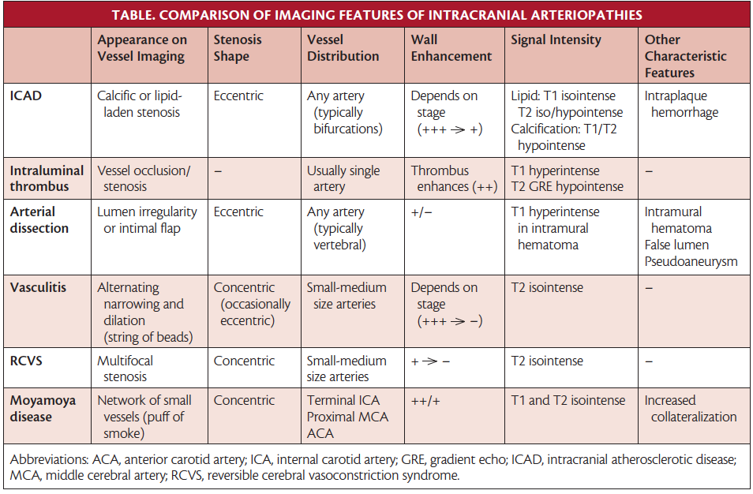

# Intracranial Atherosclerotic Disease (ICAD)

Intracranial atherosclerotic disease is a highly prevalent cause of stroke that is associated with a high risk of recurrent stroke.

The middle cerebral arteries (MCAs) are the most common site, followed by the basilar artery, the internal carotid arteries, and the intracranial vertebral arteries

# Risk Factors for ICAD
Increases: Hypertension, DM, age, smoking, inactivity
Decreases: Exercise, increased HDL-C

# Mechanisms of ICAD Related Stroke
1. Artery to artery embolism
2. Hypoperfusion (watershed)
3. Branch atheromatous disease

## Infarct Patterns
1. **Perforator pattern** - subcortical infarcts in the territory of perforating arteries that arise at the site of the intracranial stenosis (generally <1.5 cm)
2. **Territorial pattern** - infarcts located distal to the stenotic vessel (cortical, subcortical, or both) that are restricted to the territory supplied by that artery (generally >1.5 cm)
3. **Borderzone pattern** - infarcts in the internal borderzone region (corona radiata or centrum semiovale) or the cortical borderzone region (between the MCA and the posterior cerebral artery or the MCA and the anterior cerebral artery) or both
4. **Mixed pattern** - a combination of any of the above patterns

# Diagnosis of ICAD
1. Catheter angiogram (gold standard)
2. CTA
3. MRA
4. TCD

In practice, CT angiography is often particularly helpful to identify areas of calcific atherosclerotic disease, and can achieve spatial resolution to grade degree of stenosis accurately compared to catheter angiography. The severity of narrowing can be graded as normal (0%-9%), mild (10%-29%), moderate (30%-69%), severe (70%-99%), or completely occluded.

# Management of ICAD
## Acute Stroke Management
Managed according to [Acute Stroke](Acute%20Stroke.md) principles of care, regardless of the underlying etiology or suspicion for ICAD. It is not known whether adjunctive angioplasty or nonretrievable stenting is safe and effective in patients with underlying ICAD at the site of large artery occlusion.

## Antithrombotic Therapy
All patients with nonhemorrhagic infarcts, and after 24 hours in those who receive thrombolysis, are treated with aspirin and clopidogrel.

## Risk Factor Modification
1. HTN
2. DLD - target LDL-C < 1.80 mmol/L
3. DM
4. Smoking

### BP Management
It is reasonable to maintain permissive hypertension (up to 220/120 mm Hg in nonreperfused patients and < 180/100 mm Hg in reperfused patients with high-grade stenosis from ICAD) for the first 24 hours while maintaining bed rest with subsequent slow liberalization of activity. If neurologic examination findings remain stable as activity is liberalized, we gradually (eg, by 10%) start the lowering of BP between 24 and 48 hours and titrate to normotension over the next 1 to 2 weeks. This process is typically started on an inpatient service but completed on an outpatient basis.

## Endovascular Therapies
It is reasonable to consider endovascular therapy with submaximal angioplasty or the Wingspan stent in patients with recurrent strokes despite maximal medical therapy or in whom hemodynamic symptoms do not permit BP lowering. Very rarely, extracranial-intracranial bypass may be offered in patients with advanced ICAD in whom a secondary Moyamoya syndrome exists and a distal (minimally diseased) recipient artery is present.

# Resources/References
1. Banerjee, Chirantan, and Marc I. Chimowitz. “Stroke Caused by Atherosclerosis of the Major Intracranial Arteries.” _Circulation Research_ 120, no. 3 (February 3, 2017): 502–13. [https://doi.org/10.1161/CIRCRESAHA.116.308441](https://doi.org/10.1161/CIRCRESAHA.116.308441).
2. Flusty, Brent, Adam de Havenon, Shyam Prabhakaran, David S. Liebeskind, and Shadi Yaghi. “Intracranial Atherosclerosis Treatment.” _Stroke_ 51, no. 3 (March 2020): e49–53. [https://doi.org/10.1161/STROKEAHA.119.028528](https://doi.org/10.1161/STROKEAHA.119.028528).
3. “Intracranial Atherosclerotic Disease.” Practical Neurology. Bryn Mawr Communications. Accessed July 4, 2023. [https://practicalneurology.com/articles/2019-jan/intracranial-atherosclerotic-disease](https://practicalneurology.com/articles/2019-jan/intracranial-atherosclerotic-disease).
4. Psychogios, Marios, Alex Brehm, Elena López-Cancio, Gian Marco De Marchis, Elena Meseguer, Aristeidis H Katsanos, Christine Kremer, et al. “European Stroke Organisation Guidelines on Treatment of Patients with Intracranial Atherosclerotic Disease.” _European Stroke Journal_ 7, no. 3 (September 1, 2022): XLII–LXXX. [https://doi.org/10.1177/23969873221099715](https://doi.org/10.1177/23969873221099715).