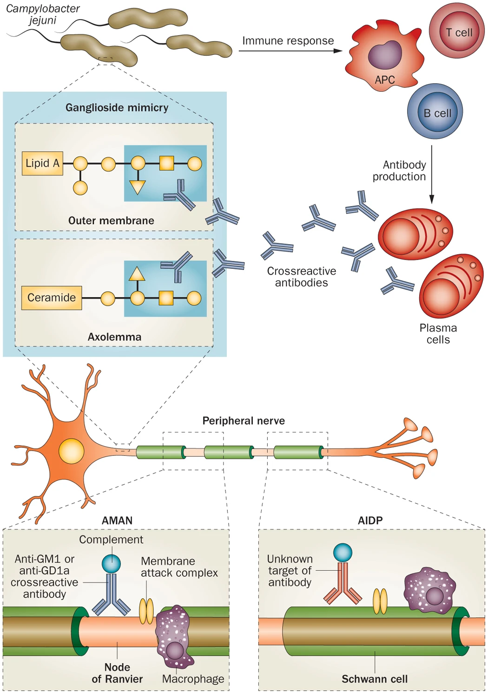
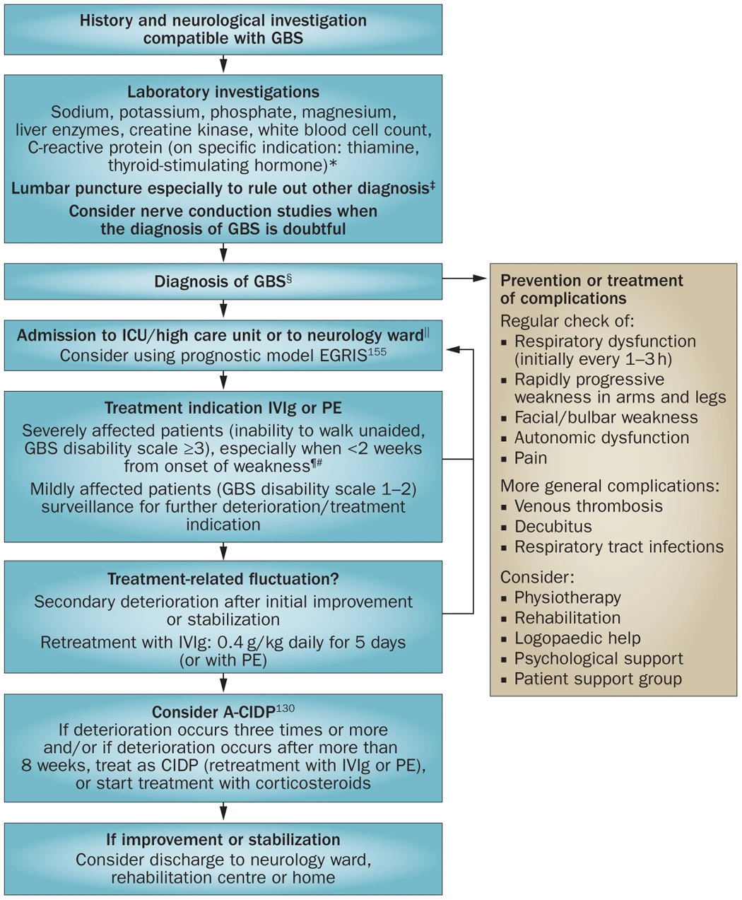

# Guillain-Barré Syndrome (GBS)
GBS (i.e. acute inflammatory demyelinating polyradiculoneuropathy or AIDP) is an acute inflammatory polyneuropathy with a reported incidence of 1:100,000 person-years. The risk of GBS increases exponentially with age (**+20% per decade of life**) and is higher in males than females. GBS is the most common and severe acute paralytic neuropathy.  GBS follows a typical clinical pattern, usually preceded by infection or immune trigger. The diagnosis is largely clinical.

# Pathogenesis/Immunology
Essentially, this is an autoimmune process leading to **acute neuropathy** which can be either **(1) demyelinating** or **(2) axonal (motor or sensory)** in type. This process is likely antibody-mediated, driven by molecular mimicry between microbial and cellular surface antigens.

The axonal neuropathy subtypes are more associated with **anti-GM1** and **anti-GD1a** IgG autoantibodies.

- **70% of cases are triggered by preceding infections (~3-12 days prior)**
	-  20-30% of cases are due to *Campylobacter jejuni*
	- Other common inciting pathogens are HHV infection such as EBV or CMV, HIV, hepatitis E, influenza A, arboviruses (Zika virus, Chikungunya), *Mycoplasma pneumoniae*, *Haemophilus influenzae*
- less commonly, after some vaccinations (?H1N1, Semple rabies virus)
- less commonly, triggered by immune/neoplastic conditions (lupus, lymphoma)

# Clinical Presentation
GBS commonly presents as a *rapidly progressing symmetric ascending flaccid paralysis* in which leg symptoms are first, with later arm involvement.

- **Patients are areflexic** due to the demyelinating/axonal processes of the LMN.
- **Paraesthesias can be present** if the sensory nerves are involved. Generally, cutaneous sensory function is preserved as these are small fibers.
- **Autonomic features** can be cardiac arrhythmias (bradycardia, orthostasis), sweating abnormalities, urinary retention, gastrointestinal dysfunction, unreactive/dilated pupils
- **Lower cranial nerves can be involved** with bulbar weakness and secretion difficulties.
- **Neuropathic pain** is common (neck, back, spine)

|GBS subtypes|Main clinical features|NCS findings|Antibodies*|
|---|---|---|---|
|Acute inflammatory demyelinating polyneuropathy (AIDP)|Sensorimotor GBS, often combined with [cranial nerve](../../Clinical%20Skills/Neurologic%20Examination/Cranial%20Nerve%20Examination.md) deficits and frequent autonomic dysfunction|Demyelinating polyneuropathy|Various‡|
|Acute motor axonal neuropathy (AMAN)|Pure motor GBS; cranial nerves rarely affected|Axonal polyneuropathy, sensory action potential normal|GM1a, GM1b  GD1a  GalNAc-GD1a|
|Acute motor sensory axonal neuropathy (AMSAN)|Resembles severe AMAN, but sensory fibres are affected, leading to sensory deficits|Axonal polyneuropathy, sensory action potential reduced or absent|GM1, GD1a|
|Pharyngeal–cervical brachial variant|Prominent weakness of oropharyngeal, facial, neck and shoulder muscles|Normal in most patients, sometimes abnormalities in arms, mostly axonal pattern|GT1a>GQ1b>>GD1a|
|Miller Fisher syndrome|Ataxia, ophthalmoplegia, areflexia|Normal in most patients; discrete changes in sensory conduction or H-reflex may be present|GQ1b, GT1a|

## Miller-Fischer Syndrome
*Miller-Fischer syndrome* is comprised of a clinical triad of (1) ataxia (2) areflexia (3) ophthalmoplegia causing diplopia. It is most associated with anti-GQ1b antibodies which is strongly associated with *C. jejuni*. MFS may be less responsive to immunotherapy than classic GBS. Peripheral muscle strength tends to be preserved unless an overlap syndrome exists (MRC 4-5/5).

## Bickerstaff Brainstem Encephalitis
*Bickerstaff brainstem encephalitis* syndrome (BBE) is also associated with anti-GQ1b antibodies and is characterized by progressive symmetric ophthalmoplegia and ataxia with mental status changes such as coma or stupor;  pyramidal signs such as hyperreflexia or pathologic reflexes; or pupillary abnormalities and bulbar palsy. Peripheral muscle strength tends to be preserved in pure BBE.

# Clinical Course of GBS
Patients reach their nadir by 4-6 weeks. The progressively worsening phase lasts less than 1 week in half of patients, and less than 2 weeks in 80% of patients. The plateau may last 1 week to several months, and then transitions to the recovery phase of illness.

Patients with acute motor axonal neuropathy (AMAN) can have two patterns of recovery: rapid or prolonged recovery.

20% of GBS patients cannot walk without assistance after 6 months, but almost all patients regain this ability within a few years. Most patients will still have residual pain and fatigue on a chronic basis.

Overall mortality is 3-7% and is generally from ventilatory/pulmonary failure, or autonomic dysfunction leading to arrhythmias.

# Diagnostic Testing
## Tests to Perform
1. FVC
2. PVR
3. MRI whole spine with gadolinium
4. CBC, lytes, urea, Cr, INR/PTT
5. LP for ?albuminocytologic dissociation
6. EMG/NCS
7. Consider anti-GQ1b antibodies

## General Investigations
- Nerve conduction studies: slowing of nerve conduction, increased latency , or axonal loss pattern with decreased cMAP.
- CSF testing: elevated protein with lack of increased cells which is known as  albuminocytologic dissociation. Mild pleocytosis can be possible (15%) but is typically transient
- Anti-GQ1b IgG can be more sensitive for MFS (positive in 85% of MFS in the first week of disease)
- BBE can show brainstem, thalamic, cerebellar, and cerebral involvement on MRI

# Treatment of GBS
## Airway Management
Close monitoring is required: telemetry, BP, FVC q4h. Consider **elective [intubation](../../Critical%20Care/Procedures/Intubation.md) using the 20-30-40 rule:
FVC <20 mL/kg, MIP 0 to -30 cm H2O, or MEP < 40 cm H2O**.

Predictors of respiratory failure in GBS (occurs in 30% of patients): Onset to admission <7d, FVC <60% predicted, presence of facial weakness, inability to cough/lift head/lift arms/stand.

## Dysautonomia (70%)
Manage and monitor for: paroxysmal hypertension (24%), orthostatic hypotension (19%), sinus tachycardia (25%), bradycardia, AV block, urinary retention, ileus.

## Optimal Care
SLP, PT/IOT, DVTp, bowel and bladder care, repositioning.

## Disease Modifying Therapy

> [!NOTE] GBS Treatment
> For nonambulatory patients within 4 weeks of symptoms, IVIg 2g/kg over 2-4 days total OR Plasma Exchange. There is likely no routine role for sequential treatments (i.e. PLEX then IVIg)

*Plasma exchange* (PE) decreases the change of worsening when started if the patient is still ambulatory and decreases the time on MV and time to independent ambulation by 50%. The optimal number or dose is not yet established, but most patients receive 5 exchanges totalling 200-250 mL/kg every other day over 10 days. Albumin is preferred to FFP as a replacement fluid.

*IVIg* is equally effective as PE. The standard dose is 0.4 g/kg daily for 5 days.

Combination therapy of PE + IVIg is not proven to be better than one alone and multiple trials have showed no improved outcomes with PE --> IVIg compared to IVIg alone. For this reason, IVIG is usually the first line treatment due to safety and ease. 

*Steroids* are not helpful in AIDP, only in [CIDP](Chronic%20Inflammatory%20Demyelinating%20Polyradiculoneuropathy%20(CIDP).md). In AIDP, it may increase the rate of relapse.

# References
1. Harrison's Principles of Internal Medicine 20E, Chapter 439
2. [Guillain-Barré syndrome - The Lancet](https://www.thelancet.com/journals/lancet/article/PIIS0140-6736(16)00339-1/fulltext)
3. [Guillain–Barré syndrome: pathogenesis, diagnosis, treatment and prognosis | Nature Reviews Neurology](https://www.nature.com/articles/nrneurol.2014.121)
4. Parrillo Critical Care Medicine