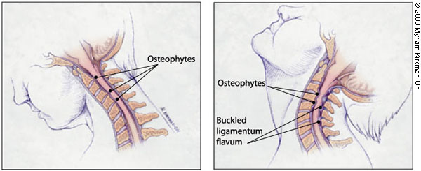
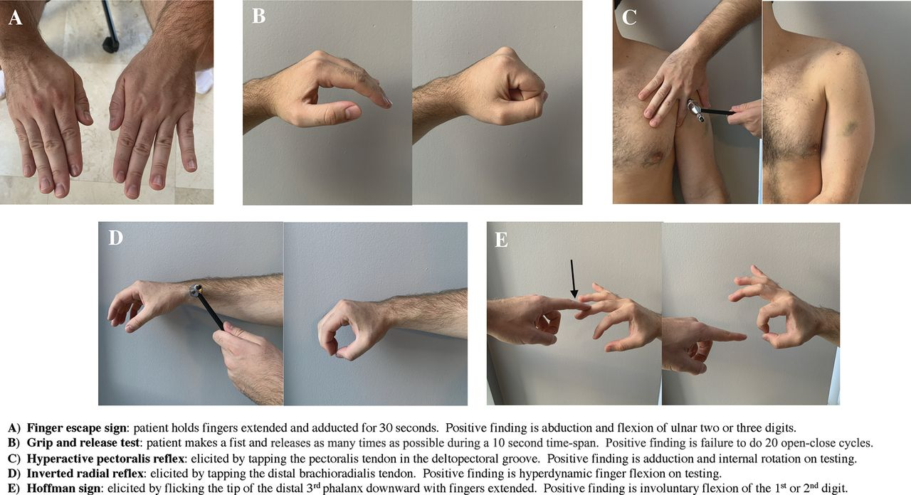
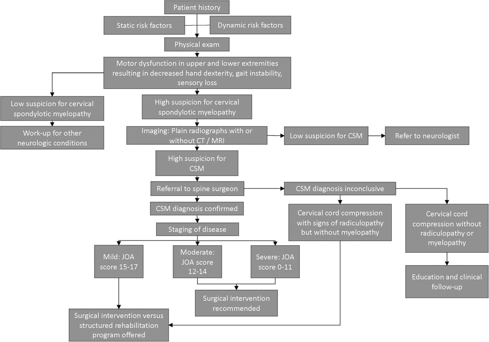

Cervical spondylotic myelopathy (CSM) is the most common spinal cord disorder in persons more than 55 years of age in North America and perhaps in the world.

# Pathophysiology
Spondylosis refers to the degenerative changes that occur in the spine, including degeneration of the joints, intervertebral discs, ligaments and connective tissue of the cervical vertebrae.

Implicated: formation of osteophytes, disc calcification, compressive loss of spinal canal dimensions. Spinal cord compression is dynamic (see below).

# Clinical Presentation
## Symptoms
Common symptoms of CSM:

- Neck stiffness
- Unilateral or bilateral deep, aching neck, arm, and shoulder pain
- Stiffness or clumsiness while walking, unsteady gait, and similar symptoms in the hands
- The hallmark symptom of CSM is weakness or stiffness in the legs.

Symptoms tend to be insidious in onset. Patients can complain of neck crepitus, "brachialgia", a dull achy feeling in the arm, and numbness or tingling in the hands.
Loss of sphincter control or frank incontinence is rare; however, some patients may complain of slight hesitancy on urination.
Symptoms may be asymmetric particularly in the legs.

## Signs
- **Atrophy of hand muscles**
- **Hyperreflexia and spasticity** (characteristic of CSM)
	- The biceps and supinator reflexes (C5 and C6) may be absent, with a brisk triceps reflex (C7). This pattern is almost pathognomonic of cord compression because of cervical spondylosis at the C5-C6 interspace
	- Ankle clonus and Babinski's sign in the feet may also be revealed.
	- Hoffmann's sign (a reflex contraction of the thumb and index finger after nipping the middle finger) is a subtle indicator of spinal cord dysfunction.
	- A stiff or spastic gait is also characteristic of CSM in its later stages.
- **Positive Lhermitte's sign**
- **Sensory loss** can be variable and asymmetric
	- Loss of posterior column function in the extremities
	- Superficial sensory loss

# Diagnosis
Clinical diagnosis and a high degree of suspicion as above.
**MRI of the C-spine is essential**. High signal changes seen in the spinal cord of patients with CSM may indicate myelomalacia or permanent spinal cord damage.

# Differential Diagnosis
- MS - lesions would be seen on MRI
- ALS - The absence of extremity sensory abnormalities on neurologic examination of a patient with myelopathy should alert the physician to the possibility of ALS. The presence of fasciculations on examination and a denervation pattern on electromyography serve as confirmatory evidence for ALS
- primary spinal cord tumors, syringomyelia, extramedullary conditions (e.g., metastatic tumors), subacute combined degeneration of the spinal cord (vitamin B12 deficiency), hereditary spastic paraplegia, normal pressure hydrocephalus and spinal cord infarction -- usually all seen on MRI as well

# Management
- 18 percent of patients with CSM will improve spontaneously
- 40 percent will stabilize
- 40 percent will deteriorate without treatment

## Nonsurgical Treatment
Watchful waiting - cervical traction, cervical immobilization, skull traction, PT.
A nonsurgical approach is usually inadvisable.

## Surgical Treatment
Once frank myelopathy occurs, surgical intervention is necessary. The primary goal of surgery is to decompress the spinal cord, thus giving the neural elements more room.
**Anterior vs posterior cervical decompression (?laminectomy) +/- fusion**

Many surgical series show “improvement,” or at least stabilization of symptoms with posterior and anterior approaches. After reviewing the surgical literature, one investigator found that the rate of successful outcome after surgery was at best 50 percent with the potential for significant postsurgical morbidity.

# References
1. [Cervical Spondylotic Myelopathy: A Common Cause of Spinal Cord Dysfunction in Older Persons | AAFP](https://www.aafp.org/pubs/afp/issues/2000/0901/p1064.html)
2. [Cervical Spondylotic Myelopathy: A Guide to Diagnosis and Management | American Board of Family Medicine](https://www.jabfm.org/content/33/2/303)