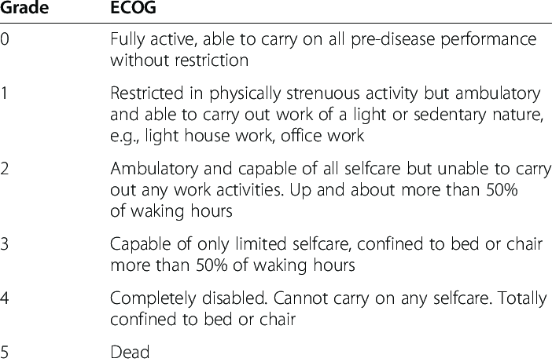

There are many factors that can predict whether someone is likely to do well or poorly with their disease. Age, the stage of a cancer, and other illnesses all affect prognosis, but PS is one of the most important variables. It is more important than a patient’s actual age in predicting how a patient is likely to do.

Patients who have a worse PS and limited functional capacity tend to have more difficulty tolerating rigorous cancer treatments. These patients have less favorable outcomes than more fit patients with better PS, regardless of the treatments given.

Many clinical trials, and the treatment recommendations that are developed from them, are restricted to more fit patients, such as those with a PS of 0 to 1 on the Zubrod scale or higher than 70 on the Karnofsky scale. As a result, there is less clinical evidence available for treatments for more frail patients with lower PS. Because nearly all anticancer treatments have potentially serious adverse effects, the risks of using certain treatments in low-PS patients may far exceed the benefits. However, other trials testing less intensive treatment approaches may allow or even focus specifically on more frail patients who need more support.

Patient PS can and usually does change over time. Patients can experience a gradual worsening of their PS as their cancer progresses, both from the cancer itself and from the cumulative adverse effects of treatments. On the other hand, effective treatment can lead to an improvement in PS if a patient is limited by cancer-related symptoms (as opposed to other chronic medical conditions unrelated to cancer) that improve as the cancer responds to treatment.

Both the KPS and ECOG scales are strong independent predictors of clinical outcome in numerous oncology populations.

# References
1.  [https://oncologypro.esmo.org/oncology-in-practice/practice-tools/performance-scales](https://oncologypro.esmo.org/oncology-in-practice/practice-tools/performance-scales)
2.  West H, Jin JO. Performance Status in Patients With Cancer. _JAMA Oncol._ 2015;1(7):998. doi:10.1001/jamaoncol.2015.3113
3.  [Performance Status in Cancer: Not Broken, But Time for an Upgrade?](https://ascopubs.org/doi/abs/10.1200/JCO.20.00721) Jessica M. Scott, Guro Stene, Elisabeth Edvardsen, and Lee W. Jones. Journal of Clinical Oncology 2020 38:25, 2824-2829
