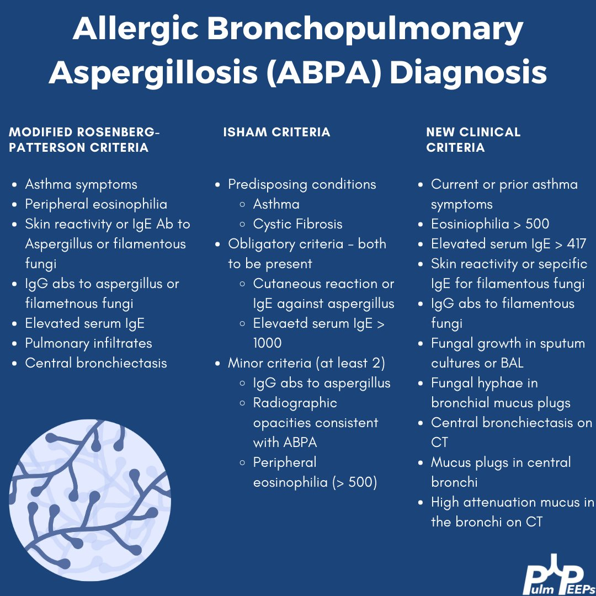

---
aliases:
  - ABPA
---
ABPA is a 

# Diagnostic Criteria
ISHAM Dx

[ASthma](Airway%20Disease/Allergic%20Asthma.md)
Pulm infiltrates
Skin and serum precipitns to aspergillus
total IgE and aspergillus specific IgE > 1000
increaed peripheral eosinophilia

