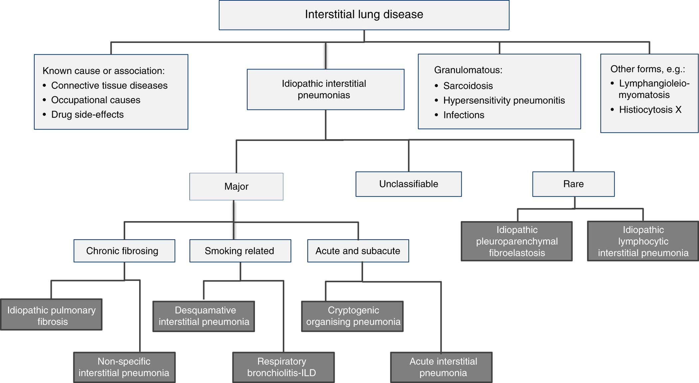
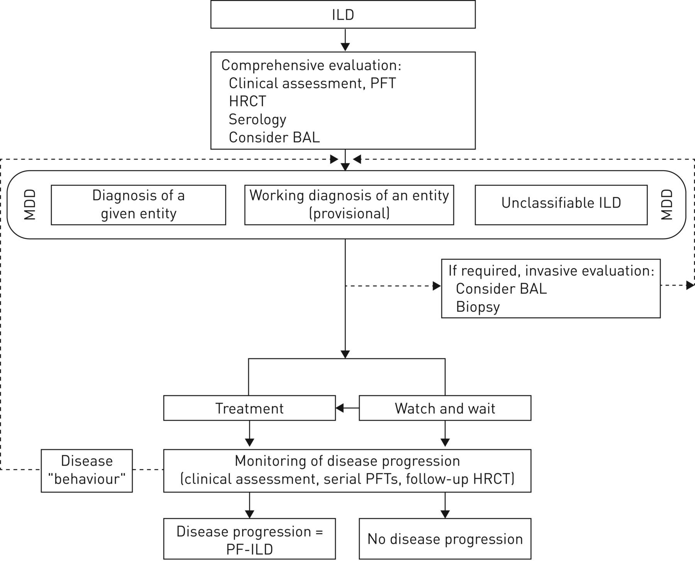

# Classification of ILDs
## Idiopathic Interstitial Pneumonias (IIPs)
- *Major idiopathic interstitial pnuemonias*
	- Chronic fibrosing
		- [Idiopathic pulmonary fibrosis (IPF)](Idiopathic%20pulmonary%20fibrosis%20(IPF).md)
		- Nonspecific interstitial pneumonia (NSIP)
	- Smoking-related
		- Respiratory bronchiolitis-interstitial lung disease
		- Desquamative interstitial pneumonia
	- Acute and subacute
		- [Cryptogenic Organizing Pneumonia](Cryptogenic%20Organizing%20Pneumonia.md) (COP)
		- Acute interstitial pneumonia (AIP; Hamman-Rich syndrome)
- *Rare idiopathic interstitial pneumonias*
	- Lymphoid interstitial pneumonia
	- Idiopathic pleuroparenchymal fibroelastosis
- *Unclassifiable*
## Known Causes/Associations
- *Connective tissue disorders*
	- Rheumatoid arthritis
	- Sjogren's syndrome
	- Systemic lupus erythematous
	- Inflammatory myositis
	- Mixed CTD
	- Systemic sclerosis
	- Interstitial pneumonia with autoimmune features (IPAF)
- *Exposure/occupational related*
	- Hypersensitivity pneumonitis
	- Pneumoconiosis
- *Drug related*
	- Methotrexate
	- Nitrofurantoin
	- Amiodarone
	- Bleomycin
## Granulomatous
- [Sarcoidosis](Sarcoidosis.md)
- Infectious
- Hypersensitivity pneumonitis

## Other
- Lymphangioleiomyomatosis
- Langerhans' cell histiocytosis
- Pulmonary alveolar proteinosis

# Diagnosis and Workup of ILDs
## Evaluation
- Family history
- Drugs and radiation exposure
- Inorganic materials: asbestos, mining, sandblasting, etc.
- Organic materials: mould/water damage, birds, farms, feather pillows, hot tubs, etc.
- Connective tissue disease: joints, rash, mechanics hands, myositis, scleroderma findings, CREST, proximal muscle weakness...

## Workup
- All patients: ANA, RF, anti-CCP, +/- other serology if clinically indicated.
	- consider sending precipitating antibodies for known antigens for HP
- HRCT
- PFTs +/- 6MWT +/- home oxygen assessment
- Consider lung biopsy if needed
- consider respirology +/- rheumatology referral

# Non-IPF ILD

# References
1. [Interstitial lung disease | European Respiratory Society](https://err.ersjournals.com/content/23/131/40)
2. [American Thoracic Society/European Respiratory Society International Multidisciplinary Consensus Classification of the Idiopathic Interstitial Pneumonias | American Journal of Respiratory and Critical Care Medicine](https://www.atsjournals.org/doi/10.1164/ajrccm.165.2.ats01)
3. [Interstitial Lung Disease in 2020 - Clinics in Chest Medicine](https://www.chestmed.theclinics.com/article/S0272-5231(21)00028-9/fulltext)
4. https://www.thoracic.org/statements/insterstitial-lung-disease.php
5. Cottin V, Hirani NA, Hotchkin DL, et al. Presentation, diagnosis and clinical course of the spectrum of progressive-fibrosing interstitial lung diseases. _European Respiratory Review_. 2018;27(150). doi:[10.1183/16000617.0076-2018](https://doi.org/10.1183/16000617.0076-2018)
6. IMR Slides 2021