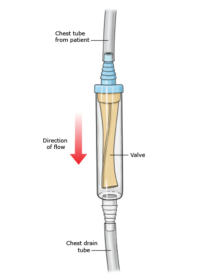

# Background
- gas in the pleural space can cause lung collapse and V:Q mismatch

# Categorization and Etiology
## Primary spontaneous pneumothorax (PSP)
- no apparent lung disease, but majority of cases develop due to the rupture of subpleural blebs or bullae.
- population/risk factors:
	- characteristically affects men < 30 with asthenic body types
	- smoking both cigarettes and cannabis is a risk factor (dose-dependent) --> **smoking cessation management**
- very rare to present/convert to tension PTX

## Secondary spontaneous pneumothorax (SSP)
- occurs in patients with underlying lung disease
- more likely to be symptomatic and lack the reserve to compensate for V:Q mismatch
- most common in COPD, but also in:
	-  **airway disease:** chronic obstructive pulmonary disease, cystic fibrosis, status asthmaticus
	-   **infectious lung disease:**_Pneumocystis carinii_ pneumonia, necrotizing pneumonias (caused by anaerobic, gram-negative bacteria or staphylococcus)
	-   **interstitial lung disease:** sarcoidosis, idiopathic pulmonary fibrosis, Langerhans’-cell granulomatosis, lymphangioleiomyomatosis, tuberous sclerosis
	-   **connective-tissue disease:** rheumatoid arthritis (causes pyopneumothorax), ankylosing spondylitis, polymyositis and dermatomyositis, scleroderma, Marfan syndrome, Ehlers–Danlos syndrome
	-   **cancer:** sarcoma, lung cancer
	-   **thoracic endometriosis** (related to menses; causes catamenial pneumothorax)

## Traumatic (iatrogenic) pneumothorax
- due to penetrating or blunt chest trauma
- iatrogenic causes: chest tube, central line, etc.)

# Examination/Investigations
- look for: dyspnea, pleuritic chest pain [shoulder tip], decreased diaphragmatic excursion, decreased breath sounds, loss of tactile fremitus, hyperresonant percussion, subcutaneous emphysema, hemodynamic collapse.
- imaging:
	- CXR (upright is best)
	- ultrasound (more sensitive, Sens/Spec > 90% in ICU patients)
	- CT chest

# Management of First PSP
## Initial Assessment and Stabilization
- Airway, Breathing, Circulation. Supplemental oxygen if hypoxemic.
- Assess the size and stability of the issue:
	- Size: small is < 2-3 cm between the pleural line and the chest wall at the level of the hilum, and large is >2-3 cm. This is done on CXR or CT.
	- Stable: controlled respiratory rate, controlled HR and blood pressure, SpO2 > 90%, and able to speak in whole sentences. All other patients are defined as unstable.

### Unstable Patients
- Immediate chest tube thoracostomy, or if delayed, then needle decompression.
- Tension PTX is rare in PSP

## Initial Management 
### Primary Spontaneous Pneumothorax
#### Small PSP
- If first episode of PSP, then these patients can be treated with observation +/- oxygen. Hospital admission generally not required.
- Supplemental oxygen theoretically improves resolution of the PTX by promoting nitrogen/air absorption. Target SpO2 >96-100% (unclear evidence), avoid positive pressure if possible (HFNC, NIV). Try for about 4-6 hours then get a repeat CXR 
- if there are significant attributable symptoms, then consider aspiration or chest tube thoracostomy (as well as searching for other lung disorders or diagnoses).

#### Large PSP
- First episode of PSP: consider all of the following:
	- aspiration. Most guidelines suggest the standard of care with a large stable first PSP is needle or catheter aspiration.
		- continue aspiration until resistance is felt or 2.5-4L of air is aspirated
		- Catheter could be left in place with a Heimlich valve (See below)
	- chest tube thoracostomy +/- ambulatory device
	- Initial observation only approach is supported by the recent **PSP trial (NEJM 2020)** which suggests that conservative observational management of PSP is noninferior to interventional management, with a lower risk of serious adverse events. Patients should be generally healthy with mild symptoms, no hemodynamic compromise, no supplemental oxygen requirement, and ambulatory.

Heimlich valve

## Chest Tube Management
### PSP
- **Size/Device:**
	- In most patients with PSP, a small-bore chest tube (≤22 Fr) or chest catheter (≤14 Fr) is placed. In most cases, a small caliber tube or catheter is sufficient for the drainage of air in patients with PSP. It is unusual in this population that an indication for a large-bore chest tube (eg, 22 to 28 Fr) is present unless the patient is unstable with tension pneumothorax, concomitant drainage of viscous pleural fluid (eg, empyema) or blood is needed, or small-bore catheter drainage is insufficient.
	- One systematic review that compared small-bore pigtail catheters with large-bore chest tubes in patients with both PSP and secondary spontaneous pneumothorax (SSP) reported that the success rate was similar in both groups (80 versus 83 percent) but pigtail catheters had a lower complication rate (odds ratio 0.49) and shorter drainage duration (mean difference -1.51 days) and hospital stay (mean difference -2.54 days).
- **Suction**
	- For the majority of patients, suction is not initially applied and the tube or catheter is connected to a water seal device only. *Lung re-expansion is achieved in 70 percent of patients within 72 hours without suction*
	- If the lung fails to re-expand within the subsequent 24 to 48 hours, worsens despite chest tube drainage, or develops a persistent air leak, low wall suction can be applied and, in some cases, a second drainage device may be needed. If suction is applied, we generally start with low rates of -10 cm H2O and increase to -20 cm H2O using a high pressure-low volume system; other forms of suction using high pressure-high volume or low pressure-high volume systems should be avoided.
		- prolonged use of suction may lead to a delay in definitive management by prolonging air flow through the leak, thereby slowing down the natural healing of a ruptured bleb
- **Followup thoracostomy management**
	- daily assessment of symptoms, air leak, complications of the chest thoracostomy (blockade, pain, bleeding). Daily CXR is not always required.
	- once the air leak is sealed, then clamp the tube/catheter
		- serial assessment + followup CXR
		- if PTX not recurred, then the tube can be removed
		- if the PTX recurs, then unclamp and repeat the process

# Management of Persistent or Recurrent PSP
- indications for this strategy:
	- prolonged air leak [PAL] (>5 days)
	- recurrent PSP
- therapeutic options:
	- pleurodesis
	- VATS > open thoracotomy

# Air Travel
Recommendations for air travel passengers after pneumothorax are largely based on anecdotal case reports [[110](https://erj.ersjournals.com/content/46/2/321#ref-110), [111](https://erj.ersjournals.com/content/46/2/321#ref-111)]. A pneumothorax, especially an undrained pneumothorax, is however an absolute contraindication to commercial air travel [[112](https://erj.ersjournals.com/content/46/2/321#ref-112)]. Definitive treatment reduces the risk of recurrence and makes air travel safer [[110](https://erj.ersjournals.com/content/46/2/321#ref-110)]; however, an individual clinical decision is usually made by the treating clinician, taking into account both airline policy and details of relevant insurance.

# References
1. [ERS task force statement: diagnosis and treatment of primary spontaneous pneumothorax | European Respiratory Society](https://erj.ersjournals.com/content/46/2/321)
2. [Treatment of primary spontaneous pneumothorax in adults - UpToDate](https://www.uptodate.com/contents/treatment-of-primary-spontaneous-pneumothorax-in-adults)
